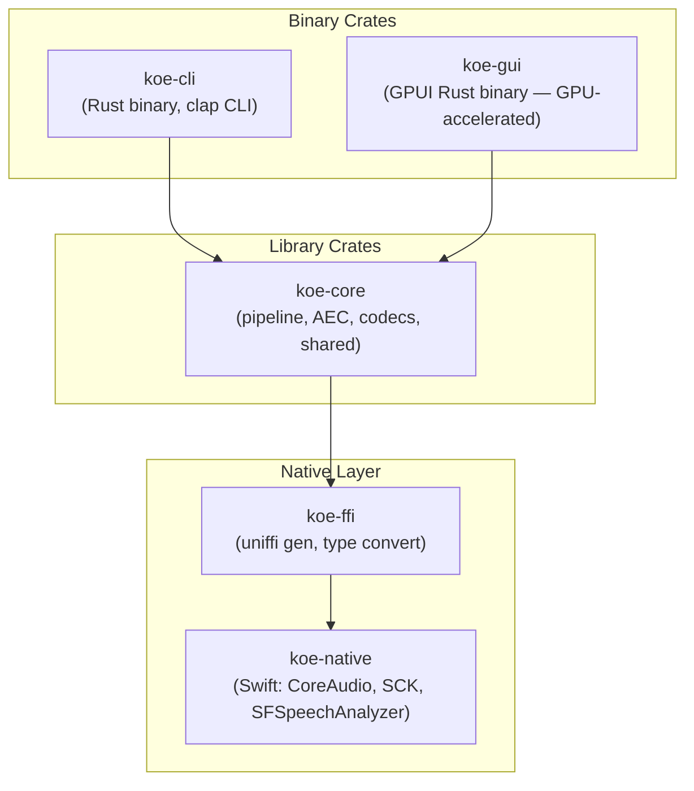
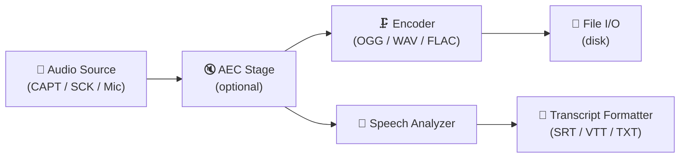
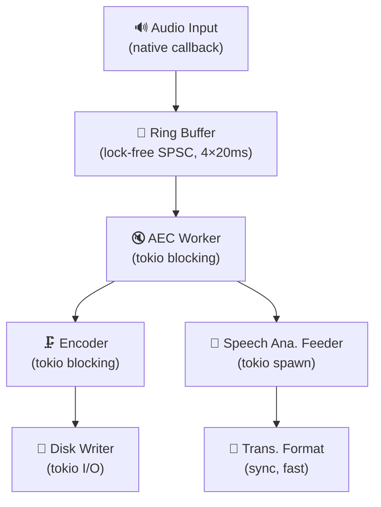

# 01 — Architecture Overview

## Crate Topology

**Direction of dependency:** `koe-cli / koe-gui` → `koe-core` → `koe-ffi` → `koe-native`

## Process Model

Koe runs as a **single macOS application process** with two optional faces:

| Mode | Process | UI Framework | Launched via |
|------|---------|--------------|-------------|
| CLI | `koe-cli` binary (terminal) | None (stdout/stderr) | `koe record ...` in shell |
| GUI | `koe-gui.app` bundle | GPUI (Rust, Metal-backed) | `.app` double-click / `open` |

Both modes share `koe-core` for all pipeline logic. The GUI process is a pure
Rust binary with a thin native `.dylib` shim for macOS frameworks.

### CLI vs GUI: What Differs

| Concern | CLI | GUI |
|---------|-----|-----|
| Permission prompts | Terminal stderr with URLs to System Settings | GPUI modal dialogs → system TCC prompts |
| Audio source selection | CLI flags (`--source system`, `--source mic`) | App picker UI backed by SCK shareable content |
| Progress feedback | ANSI progress bar / status lines | GPUI Canvas waveform + UniformList live transcript |
| Output target | Files written to `--output` path | File + in-memory preview |
| Lifecycle | One-shot; runs until SIGINT or duration limit | Long-running; dock presence, menu bar, background-able |

## Layered Data Flow

Key insight: the **AEC stage is upstream of both branches**. Echo-cancelled
audio feeds both the speech recognizer and the file writer, so the saved
recording is clean and the transcription is accurate.

## Threading Model (Rust Side)

- **Audio input callback** (native thread): Minimal work — copy samples into
  the ring buffer and signal. No allocation, no lock contention.
- **Ring buffer**: Lock-free single-producer-single-consumer (SPSC). Sized for
  4 × 20 ms chunks (~3200 samples at 48 kHz stereo f32). Wraps transparently.
- **AEC worker**: Pulls from ring buffer, runs AEC filter, pushes clean frames
  onto a broadcast channel (tokio `broadcast` for multiple consumers).
- **Encoder + SA Feeder**: Both consume the same clean stream. Encoder writes
  compressed audio to disk. SA Feeder hands PCM chunks to the native
  `SFSpeechAnalyzer`.
- **Transcript formatter**: Receives `SFSpeechAnalyzer` segment callbacks via
  FFI, formats into output format, writes/emits incrementally.

## Error Handling Philosophy

- **Native callbacks must not panic.** Errors in audio capture are logged and
  the capture stream is gracefully torn down.
- **Rust core uses `thiserror`** for typed errors at module boundaries.
- **CLI** exits with a non-zero code and a stderr message.
- **GUI** surfaces errors as in-app notifications (not modal dialogs) so
  recording state is not disrupted.

## Feature Flags

| Feature | Default | Description |
|---------|---------|-------------|
| `aec` | on | Echo cancellation (pulls in DSP dep) |
| `ogg` | on | OGG Vorbis encoder support |
| `system-audio` | on | Core Audio Process Tap capture |
| `screen-audio` | on | ScreenCaptureKit capture |
| `cli` | on | Build `koe-cli` binary |
| `gui` | off | Build GUI (requires macOS SDK + Xcode) |
