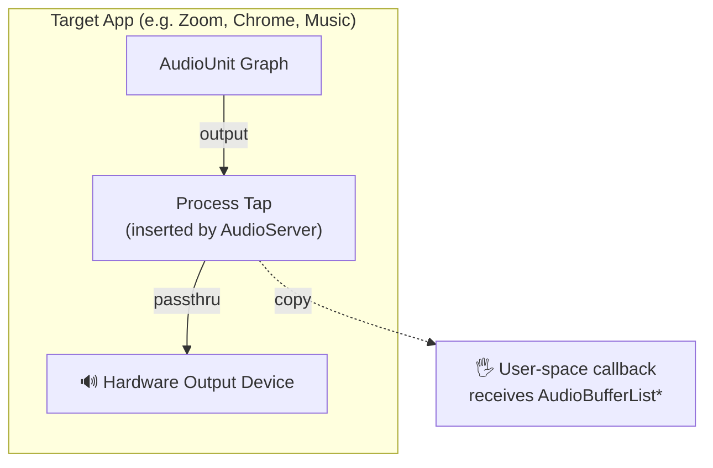

# 02 — Core Audio Process Tap

## Overview

Core Audio Process Tap (`kAudioProcessTapType`) is a macOS Audio Server plug-in
mechanism that inserts a user-space callback into the audio pipeline of a
specific process. It captures pre-mix audio directly from the target process's
output, before it reaches the hardware output device.

This is the preferred mechanism for capturing **system audio** (a specific
app's playback) with zero additional latency and no audible loopback hackery.

## How It Works



The tap is **transparent**: audio still flows to the output device
uninterrupted. We receive a copy of each buffer.

## API Surface (Swift)

```swift
// koe-native/Sources/AudioTap/AudioTap.swift

public final class AudioTap {
    /// Initialize a tap on a given process identified by PID.
    /// - Parameter pid: Target process ID
    /// - Throws: AudioTapError if the process does not have an audio output
    public init(pid: pid_t) throws

    /// Start capturing. The `callback` is invoked on a real-time thread.
    /// - Parameter callback: (buffer: UnsafePointer<Float>, frameCount: Int, streamDesc: AudioStreamBasicDescription) -> Void
    public func start(callback: @escaping AudioTapCallback) throws

    /// Stop capturing and remove the tap.
    public func stop()
}

public typealias AudioTapCallback = (
    _ buffer: UnsafePointer<Float>,
    _ frameCount: Int,
    _ streamDesc: AudioStreamBasicDescription
) -> Void
```

## Core Audio Calls Involved

| Call | Purpose |
|------|---------|
| `AudioObjectGetPropertyData(kAudioHardwarePropertyDefaultOutputDevice)` | Find default output device |
| `AudioObjectGetPropertyData(kAudioDevicePropertyDeviceUID)` | Get UID for tap |
| `AudioHardwareCreateProcessTap()` (deprecated) or direct HAL plug-in | Create tap on target PID |
| `AudioObjectSetPropertyData(kAudioProcessTapProperty...)` | Configure tap format |
| `AudioObjectRemovePropertyListener` + destroy | Tear down tap |

> **Note:** As of macOS 14, `AudioHardwareCreateProcessTap` is deprecated.
> The replacement is the Audio Server Plug-in API (`kAudioServerPlugIn`).
> The native layer must use the newer API path on macOS 14+ with a
> compile-time fallback to the deprecated API on macOS 13 for compatibility.

## Format Normalization

Process taps deliver audio in the **process's native format** (sample rate,
channel count, bit depth). The native layer **always resamples to a canonical
format** before handing data to Rust:

| Property | Canonical Value |
|----------|-----------------|
| Sample rate | 48,000 Hz |
| Channels | 2 (stereo), interleaved |
| Sample format | Float32 |
| Buffer size | Power-of-two multiple of 20 ms (~960 frames at 48 kHz) |

Resampling uses `AudioConverter` with an `AudioConverterRef` configured for
the source→canonical conversion. This avoids pulling a full resampling library
into the native layer.

## Process Discovery

The Rust CLI/GUI needs to enumerate audio-emitting processes. The native
layer exposes:

```swift
/// Returns an array of (pid: pid_t, name: String, bundleID: String?)
public func enumerateAudioProcesses() -> [(pid_t, String, String?)]
```

This walks `NSWorkspace.runningApplications`, filters to those with an
associated audio object via `AudioObjectGetPropertyDataSize` on the process
property, and returns identifying info.

## Real-Time Safety

The tap callback fires on a **real-time priority thread** owned by the
AudioServer. Strict rules:

- **No allocation** (no `malloc`, no `swift_allocObject`)
- **No lock acquisition** (no `os_unfair_lock`, no `pthread_mutex`)
- **No I/O** (no file writes, no IPC that may block)
- **No Objective-C messaging** (no `objc_msgSend` — Swift struct/enum only)

Our callback does exactly one thing: `memcpy` into a pre-allocated lock-free
ring buffer and advances a write pointer. The Rust side consumes at its own
pace.

If the consumer falls behind (buffer full), the callback **drops the chunk**
and increments a drop counter. This avoids priority inversion against the
AudioServer.

## Limitations

1. **One tap per process.** You cannot install multiple taps on the same PID.
2. **No system-wide tap.** There is no "tap everything" API. To capture all
   system audio, combine per-process taps or use a virtual audio device
   (separate design, not scoped for v1).
3. **Requires `com.apple.security.cs.disable-library-validation`** or the
   process must be signed with the `com.apple.audio.tap` entitlement.
4. **Not available in App Sandbox.** Koe cannot be sandboxed and must request
   the audio tap entitlement at provisioning time.
