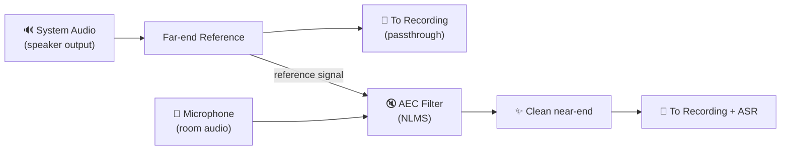

# 05 — Echo Cancellation

## Problem Statement

When Koe captures **both** microphone input and system audio output
simultaneously (e.g., recording a video call), the microphone will pick up the
speaker output, creating an echo in the mixed recording. The transcription
quality also degrades because the recognizer hears the same speech twice
(once clean from system audio, once echoed through the mic).

Acoustic Echo Cancellation (AEC) removes the far-end signal (system audio)
from the near-end signal (microphone) in real time.

## When AEC Is Applied



AEC is **only active when both sources are enabled**:

| Source Config | AEC? |
|---------------|------|
| System audio only | No |
| Microphone only | No |
| System audio + Microphone | **Yes** |

The user can also disable AEC explicitly with `--no-aec`.

## AEC Algorithm: NLMS with Double-Talk Detection

### Why NLMS (Normalized Least Mean Squares)

- **Low latency** — operates sample-by-sample or on small frames (5–10 ms)
- **Linear computational complexity** — O(N) where N = filter length
- **No frequency-domain transform** — simpler implementation, no FFT overhead
- **Well-understood** — easy to debug, tune, and test

### Filter Configuration

| Parameter | Value | Rationale |
|-----------|-------|-----------|
| Filter length | 4096 taps (~85 ms at 48 kHz) | Covers typical room impulse responses |
| Block size | 256 samples (~5.3 ms) | Low latency, good vectorization |
| Step size (μ) | 0.01 (adaptive) | Normalized by signal power (hence NLMS) |
| Double-talk threshold | 6 dB above far-end power | Conservative; avoids filter divergence |
| Convergence time | < 1 second (typical) | Fast enough for call-start scenarios |
| ERLE target | > 20 dB | Achievable in most acoustic environments |

**ERLE** (Echo Return Loss Enhancement) measures how much echo is suppressed.
20 dB means the echo is reduced to 1% of its original amplitude.

### Double-Talk Detection

When both the far-end (speaker) and near-end (microphone) are active
simultaneously, the AEC filter may diverge if it adapts during double-talk.
The detector uses the **Geigel algorithm**:

```
double_talk = (|mic[n]| > threshold * max(|ref[n]|, |ref[n-1]|, ..., |ref[n-N]|))
```

If double-talk is detected, filter adaptation is **paused** but filtering
continues with the current coefficients.

### Comfort Noise Generation

When the AEC suppresses echo heavily, the resulting silence can sound
"dead." Koe optionally mixes in **comfort noise** — low-amplitude noise
shaped to match the near-end noise floor:

```
noise_floor = estimate_noise_floor(mic_signal)
comfort_noise = noise_floor * white_noise()
output[n] = aec_output[n] + comfort_noise[n]  # Only during echo-only periods
```

Comfort noise is configurable: `--comfort-noise on|off` (default: on).

## Implementation in Rust

```rust
// koe-core/src/aec/mod.rs (sketch)

pub struct AcousticEchoCanceller {
    filter: Vec<f32>,            // Adaptive filter taps
    ref_buffer: Vec<f32>,        // Recent far-end samples
    step_size: f32,
    filter_length: usize,
    block_size: usize,
    noise_floor: f32,
}

impl AcousticEchoCanceller {
    pub fn new(config: AecConfig) -> Self { /* ... */ }

    /// Process one audio block.
    /// `far_end`  — system audio captured (reference)
    /// `near_end` — microphone captured (to be cleaned)
    /// Returns the echo-cancelled near-end signal.
    pub fn process_block(
        &mut self,
        far_end: &[f32],
        near_end: &[f32],
    ) -> Vec<f32> {
        // 1. Detect double-talk
        // 2. If no double-talk: NLMS adaptation step
        // 3. Apply filter to produce estimated echo
        // 4. Subtract estimate from near-end
        // 5. Mix comfort noise during echo-only periods
        // 6. Return clean near-end
    }

    pub fn reset(&mut self) {
        self.filter.fill(0.0);
        self.ref_buffer.fill(0.0);
        self.noise_floor = 0.0;
    }
}
```

## Frame Alignment

For AEC to work correctly, the far-end and near-end signals must be **time
aligned** within a few samples. A constant offset is tolerable (the filter
learns it as a delay), but jitter is not.

| Signal Path | Latency | Alignment Strategy |
|-------------|---------|--------------------|
| System audio (Process Tap) | ~0 ms (real-time) | Timestamp both streams from the same clock (`mach_absolute_time`) |
| System audio (SCK) | ~1–2 frames (callback) | Buffered in ring buffer with presentation timestamps |
| Microphone (AudioQueue / HAL) | ~1–2 frames (callback) | Same ring buffer design; timestamps assigned by native callback |

In practice: both streams use a shared `AudioClock` abstraction that timestamps
each chunk with the host's monotonic clock. The AEC stage reads the next chunk
from each stream and aligns by timestamp before processing.

## Echo Path Changes

The acoustic echo path changes when:
- The user moves the microphone
- The user adjusts speaker volume
- Room configuration changes (doors open/close)

The NLMS filter adapts continuously (outside double-talk), so it tracks these
changes automatically. The filter does **not** freeze permanently — it is
always adapting when safe.

## Performance Budget

| Metric | Budget |
|--------|--------|
| CPU per block (256 samples) | < 50 µs (ARM64, single core) |
| Memory (filter state) | < 64 KB (4096 taps × 4 bytes × 2 buffers) |
| Added latency | < 6 ms (one block + safety margin) |

## Testing Strategy

1. **Synthetic loopback**: Feed a known signal into far-end, mix with near-end
   silence, verify cancellation.
2. **Recorded test vectors**: Use pre-recorded far-end/near-end pairs from
   real environments with ground-truth clean near-end.
3. **ERLE measurement**: Automate ERLE computation in CI to detect regressions.
4. **Subjective CLI test**: `koe record --source both --monitor` to listen to
   the AEC output in real time during development.

## Alternatives Considered

| Alternative | Rejected Because |
|-------------|-----------------|
| WebRTC AEC (AEC3) | C++ dependency, complex build integration; overkill for a non-telephony tool |
| SpeexDSP AEC | Outdated; poor double-talk performance |
| Apple Voice Processing I/O | Only available for specific AudioUnit subtypes; not compatible with Process Tap |
| No AEC; just mute mic during playback | Poor UX for conversation recording |
| Kalman-filter AEC | Higher complexity; marginal improvement over NLMS for our use case |
