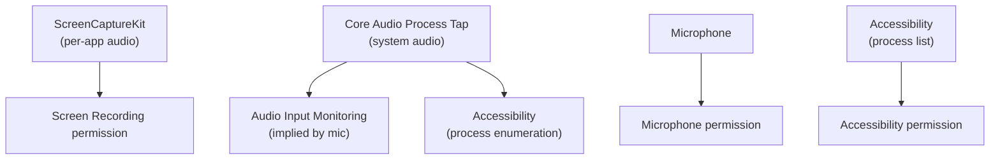
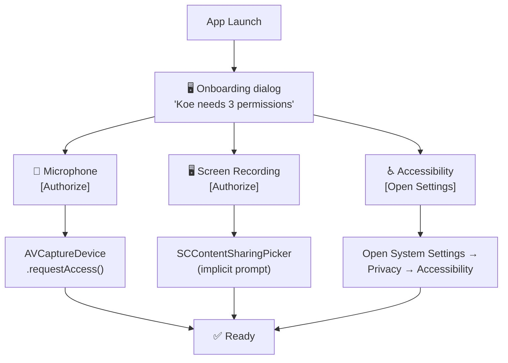
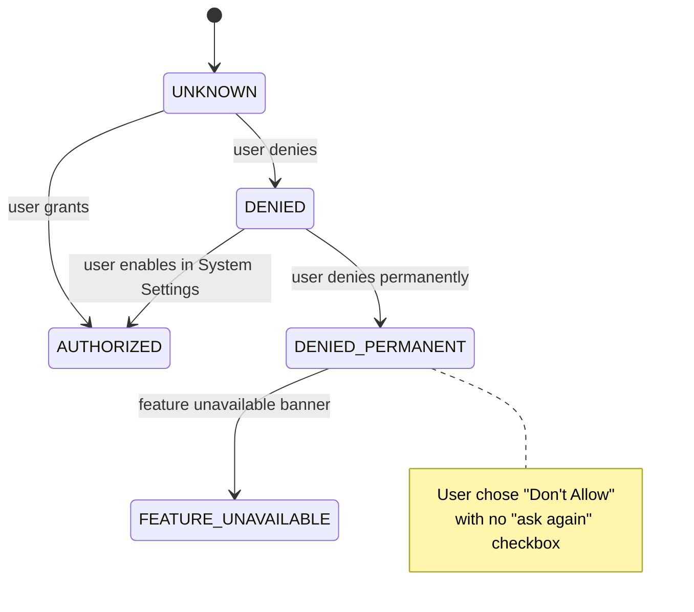

# 06 — Permission Model

## macOS Permission Landscape

Koe requires several privacy-sensitive permissions governed by macOS TCC
(Transparency, Consent, and Control). Each permission has an entitlement
(static, embedded in the app bundle) and a user-facing prompt (runtime).

## Required Permissions

| # | Permission | Entitlement Key | TCC Service | Required For |
|---|-----------|----------------|-------------|-------------|
| 1 | Microphone | `com.apple.security.device.audio-input` | `kTCCServiceMicrophone` | Mic capture |
| 2 | Screen Recording | `com.apple.security.device.screen-recording` | `kTCCServiceScreenCapture` | ScreenCaptureKit audio |
| 3 | Audio Input Monitoring | `com.apple.security.device.audio-input` | `kTCCServiceListenEvent` | Process Tap (system audio) |
| 4 | Accessibility | `com.apple.security.device.accessibility` | `kTCCServiceAccessibility` | Process enumeration, PID lookup |

### Permission Dependency Map



## Entitlements File

```xml
<!-- koe-gui/koe.entitlements -->
<?xml version="1.0" encoding="UTF-8"?>
<!DOCTYPE plist PUBLIC "-//Apple//DTD PLIST 1.0//EN"
 "http://www.apple.com/DTDs/PropertyList-1.0.dtd">
<plist version="1.0">
<dict>
    <key>com.apple.security.device.audio-input</key>
    <true/>

    <!-- ScreenCaptureKit -->
    <key>com.apple.security.device.screen-recording</key>
    <true/>

    <!-- Required for Process Tap -->
    <key>com.apple.security.cs.disable-library-validation</key>
    <true/>
    <key>com.apple.security.get-task-allow</key>
    <true/>

    <!-- Not sandboxed — required for Process Tap -->
    <key>com.apple.security.app-sandbox</key>
    <false/>
</dict>
</plist>
```

> **Important:** Koe cannot use App Sandbox because Core Audio Process Tap
> requires loading an Audio Server Plug-in, which is incompatible with sandbox
> restrictions. This means Koe must be **notarized but not sandboxed**, and
> must pass Apple's review explaining why sandbox exemption is necessary.

## Info.plist Usage Description Keys

```xml
<key>NSMicrophoneUsageDescription</key>
<string>
Koe needs microphone access to record your voice during calls and meetings.
Audio is processed entirely on-device and is never uploaded.
</string>

<key>NSScreenCaptureUsageDescription</key>
<string>
Koe needs screen recording access to capture audio from apps during recording.
Screen video is discarded immediately — only audio is kept.
</string>
```

## Permission Request Flow (GUI)



### Permission State Machine



## Permission Request Flow (CLI)

The CLI cannot trigger system TCC dialogs directly (they are window-modal).
Instead, it detects missing permissions and instructs the user:

```
$ koe record --source mic
Error: Microphone permission not granted.

Koe needs microphone access. Please grant it:
  1. Open System Settings → Privacy & Security → Microphone
  2. Enable the toggle for your terminal app (Terminal.app / iTerm2.app)
  3. Restart your terminal, then re-run: koe record --source mic

Alternatively, use the GUI app (Koe.app) which handles permissions automatically.
```

### Permission Check Implementation

```swift
// koe-native/Sources/Permissions/PermissionChecker.swift

public enum Permission {
    case microphone
    case screenRecording
    case accessibility
}

public enum PermissionStatus {
    case authorized
    case denied
    case restricted   // MDM / parental controls
    case notDetermined
}

public func checkPermission(_ permission: Permission) -> PermissionStatus {
    switch permission {
    case .microphone:
        switch AVCaptureDevice.authorizationStatus(for: .audio) {
        case .authorized: return .authorized
        case .denied:    return .denied
        case .restricted: return .restricted
        case .notDetermined: return .notDetermined
        @unknown default: return .notDetermined
        }
    case .screenRecording:
        // SCK does not expose a direct preflight check.
        // We test by requesting SCShareableContent and catching denial.
        // For a lightweight check, we use CGPreflightScreenCaptureAccess()
        if CGPreflightScreenCaptureAccess() { return .authorized }
        else                                { return .denied    }
    case .accessibility:
        return AXIsProcessTrusted() ? .authorized : .denied
    }
}
```

## Accessibility Permission: Why?

Core Audio Process Tap requires the PID of the target process. Enumerating
running applications and finding their audio objects requires querying window
server properties (`CGWindowListCopyWindowInfo`) or using Accessibility API to
identify the correct audio-emitting process. The Accessibility permission also
enables `AXUIElementCopyAttributeValue` for richer process metadata.

**Fallback without Accessibility:** If the user declines Accessibility, Koe
can still enumerate processes via `NSWorkspace.runningApplications` (no
permission needed) but loses the ability to correlate audio objects to
specific applications automatically. The user must supply the PID manually
via CLI or pick from a limited list in GUI.

## App Notarization Notes

Because Koe is **not sandboxed**, Apple's notarization review will be more
rigorous:

1. The app must include a clear privacy policy (bundled as `PrivacyInfo.xcprivacy`)
2. Every entitlement must be justified in the App Review notes
3. The `com.apple.security.cs.disable-library-validation` entitlement needs a
   specific technical justification referencing Core Audio Process Tap
4. The binary must pass `codesign --verify --deep --strict` and Gatekeeper checks
5. Hardened Runtime (`com.apple.security.cs.allow-jit`, etc.) must be compatible
   with Rust's code generation

## Privacy Manifest

```xml
<!-- PrivacyInfo.xcprivacy -->
<key>NSPrivacyAccessedAPITypes</key>
<array>
    <dict>
        <key>NSPrivacyAccessedAPIType</key>
        <string>NSPrivacyAccessedAPICategorySystemBootTime</string>
        <key>NSPrivacyAccessedAPITypeReasons</key>
        <array>
            <string>35F9.1</string> <!-- Audio timestamp alignment -->
        </array>
    </dict>
    <dict>
        <key>NSPrivacyAccessedAPIType</key>
        <string>NSPrivacyAccessedAPICategoryDiskSpace</string>
        <key>NSPrivacyAccessedAPITypeReasons</key>
        <array>
            <string>7D9E.1</string> <!-- Check disk space before recording -->
        </array>
    </dict>
</array>
```
