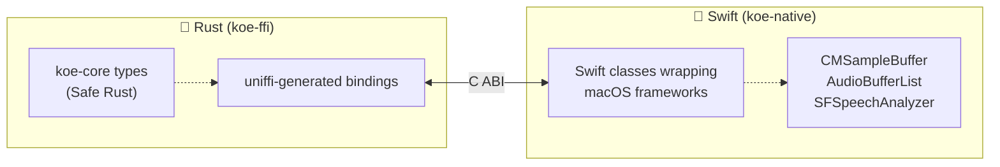
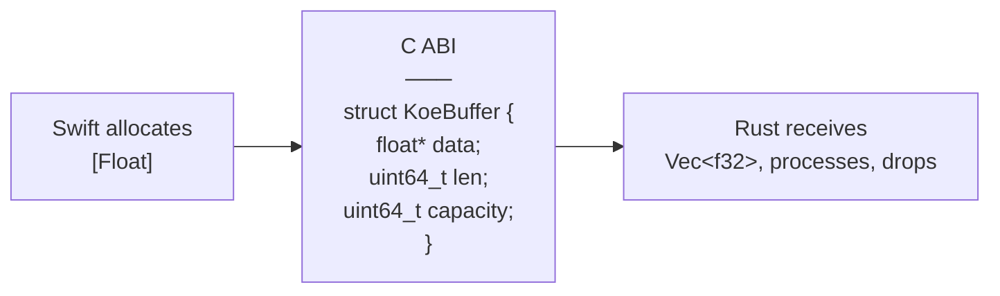
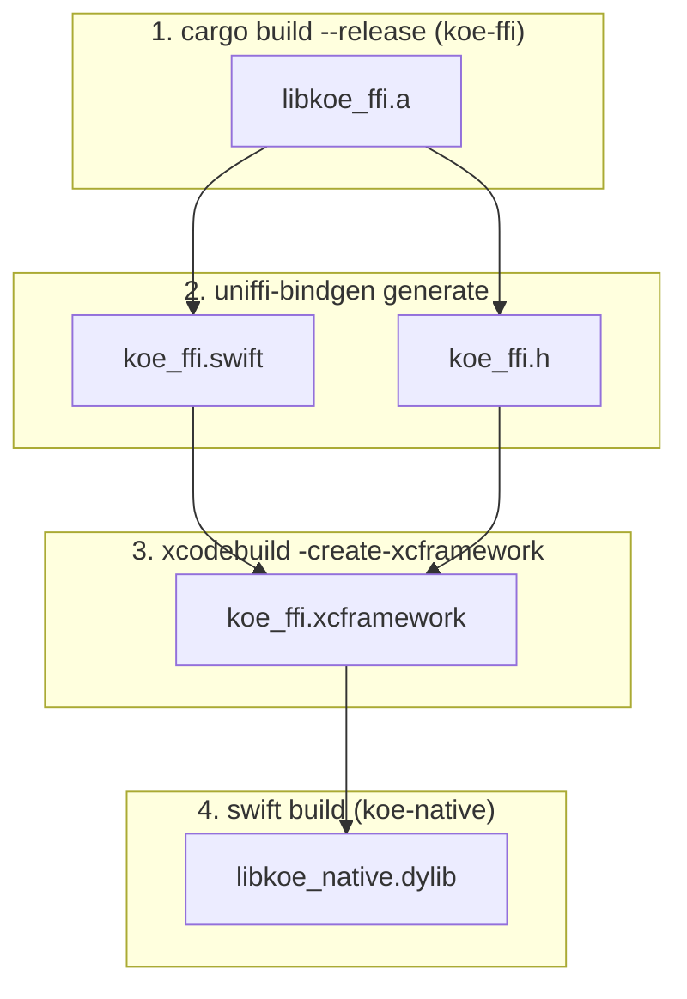

# 07 — Native Bridge (FFI)

## Boundary Design



The boundary is a **C ABI** generated by **uniffi-rs**. uniffi accepts a Rust
`#[uniffi::export]` interface definition and generates:
- C header (`koe_ffi.h`) — consumed by Swift via module map
- Swift bindings — type-safe wrappers over the C functions
- Rust scaffolding — `extern "C"` dispatch functions

## Why uniffi-rs?

| Option | Pros | Cons |
|--------|------|------|
| **uniffi-rs** | Type-safe, auto-generated, async support, enum/struct bridging | Build complexity, requires UDL or proc-macros |
| Raw `extern "C"` + `cbindgen` | Minimal deps, full control | Manual type conversion, error-prone |
| `swift-bridge` | Rust→Swift focused | Less mature, limited async |
| C++ shim layer | Direct ObjC++ interop | Adds C++ to build, two-step FFI |

**Decision:** uniffi-rs (proc-macro variant, `uniffi::export`). It generates
correct, safe bindings and handles non-trivial types (enums with data, `Vec<T>`,
`Result<T, E>`) that raw FFI makes painful.

## Core Interface Definition

```rust
// koe-ffi/src/lib.rs (sketch)

#[uniffi::export]
pub enum AudioSourceConfig {
    /// Capture system audio from a specific app via ScreenCaptureKit
    AppAudio { bundle_id: String },
    /// Capture system audio from a specific process via Process Tap
    PidAudio { pid: i32 },
    /// Capture microphone input
    Microphone,
    /// Capture both system audio and microphone (AEC active)
    Both { bundle_id: String },
}

#[uniffi::export]
pub enum Permission {
    Microphone,
    ScreenRecording,
    Accessibility,
}

#[uniffi::export]
pub enum PermissionStatus {
    Authorized,
    Denied,
    Restricted,
    NotDetermined,
}

#[uniffi::export]
pub struct TranscriptionSegment {
    pub text: String,
    pub start_ms: i64,
    pub end_ms: i64,
    pub is_final: bool,
    pub confidence: f32,
}

#[uniffi::export]
pub struct AppInfo {
    pub pid: i32,
    pub name: String,
    pub bundle_id: Option<String>,
    pub has_audio: bool,
}

// ── Callbacks from native → Rust ──

#[uniffi::export(callback_interface)]
pub trait AudioCallback: Send + Sync {
    /// Called on the native capture thread.
    /// `pcm` is Float32, 48 kHz, interleaved stereo.
    /// `timestamp_ms` is a monotonic clock value for alignment.
    fn on_audio(&self, pcm: Vec<f32>, timestamp_ms: u64);
}

#[uniffi::export(callback_interface)]
pub trait TranscriptionCallback: Send + Sync {
    fn on_segment(&self, segment: TranscriptionSegment);
    fn on_error(&self, error: String);
}

// ── API exported to Swift ──

#[uniffi::export]
pub fn check_permission(permission: Permission) -> PermissionStatus { /* ... */ }

#[uniffi::export]
pub fn request_permission(permission: Permission) -> PermissionStatus { /* ... */ }

#[uniffi::export]
pub fn enumerate_apps() -> Vec<AppInfo> { /* ... */ }

#[uniffi::export]
pub fn start_capture(
    source: AudioSourceConfig,
    audio_callback: Box<dyn AudioCallback>,
) -> Result<CaptureHandle, CaptureError> { /* ... */ }

#[uniffi::export]
pub fn stop_capture(handle: CaptureHandle) { /* ... */ }

#[uniffi::export]
pub fn start_transcription(
    locale: String,
    callback: Box<dyn TranscriptionCallback>,
) -> Result<TranscriptionHandle, TranscriptionError> { /* ... */ }

#[uniffi::export]
pub fn feed_transcription_audio(handle: TranscriptionHandle, pcm: Vec<f32>) { /* ... */ }

#[uniffi::export]
pub fn finalize_transcription(handle: TranscriptionHandle) { /* ... */ }

#[uniffi::export]
pub fn start_recording(
    source: AudioSourceConfig,
    output_path: String,
    locale: String,
    format: OutputFormat,
    enable_aec: bool,
    comfort_noise: bool,
    progress_callback: Box<dyn ProgressCallback>,
) -> Result<RecordingHandle, RecordingError> { /* ... */ }

#[uniffi::export]
pub fn stop_recording(handle: RecordingHandle) -> Result<RecordingSummary, RecordingError> { /* ... */ }

#[uniffi::export]
pub fn pause_recording(handle: RecordingHandle) { /* ... */ }

#[uniffi::export]
pub fn resume_recording(handle: RecordingHandle) { /* ... */ }
```

## Swift-Side Consumption

```swift
// koe-native auto-generates: KoeFfi.swift (uniffi output)
import KoeFfi

let handle = try KoeFfi.startRecording(
    source: .appAudio(bundleId: "com.google.Chrome"),
    outputPath: "/Users/me/recording.ogg",
    locale: "en-US",
    format: .ogg,
    enableAec: true,
    comfortNoise: false,
    progressCallback: MyProgressCallback()
)

// Later:
let summary = try KoeFfi.stopRecording(handle: handle)
print("Recorded \(summary.durationSec) seconds, \(summary.transcriptSegments.count) segments")
```

## Memory Model



- **Audio buffers (Swift→Rust):** Swift allocates, passes ownership. Rust
  receives a `Vec<f32>` and drops it after use. uniffi handles the conversion.
- **Callbacks (Rust→Swift):** Rust holds an `Arc<dyn CallbackTrait>`. The
  underlying object is a Swift class. uniffi's callback interface manages the
  retain/release lifecycle.
- **No shared mutable state across FFI.** The ring buffer is entirely on the
  Swift side. The Rust side receives owned copies of each chunk.

## Build Integration



For development, step 3 is replaced by a direct `.a` + module map reference
to avoid the xcframework packaging overhead.

## Error Conversion

```rust
// koe-ffi/src/error.rs

#[derive(Debug, thiserror::Error, uniffi::Error)]
pub enum CaptureError {
    #[error("Permission denied: {0}")]
    PermissionDenied(String),

    #[error("No audio source found for {bundle_id}")]
    NoAudioSource { bundle_id: String },

    #[error("Capture stream error: {msg}")]
    StreamError { msg: String },

    #[error("Internal error: {msg}")]
    Internal { msg: String },
}
```

uniffi maps `Result<T, E>` where `E: uniffi::Error` into Swift's `throws`.
The Swift side catches typed errors:

```swift
do {
    let handle = try KoeFfi.startRecording(...)
} catch let error as CaptureError {
    switch error {
    case .permissionDenied(let msg): /* ... */
    case .noAudioSource(let bundleId): /* ... */
    // ...
    }
}
```

## Async Considerations

uniffi supports `async fn` for Rust exports. However, the audio capture
callback is inherently synchronous (on a real-time or serial queue). The
callbacks are executed synchronously — the Rust side must not block.

For long-running operations (start/stop recording), the Swift side calls them
from a cooperative async context (Swift concurrency). uniffi generates
`async` Swift functions for any `#[uniffi::export]` fn that is `async` in
Rust.
