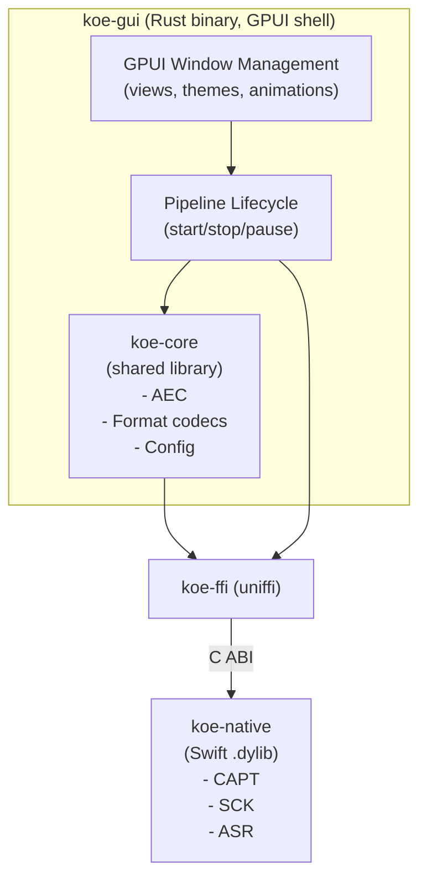
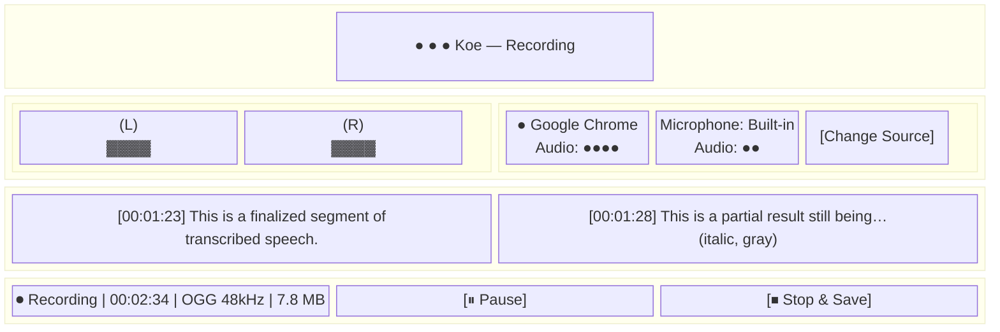
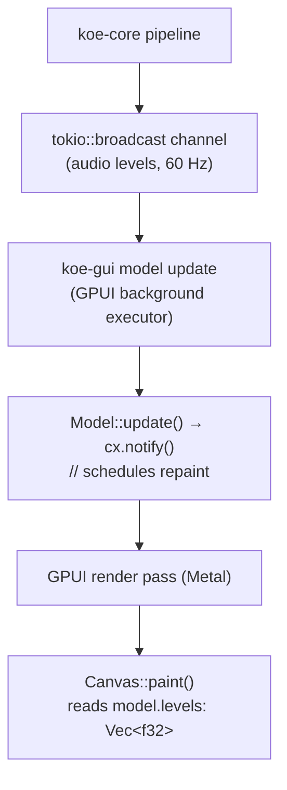
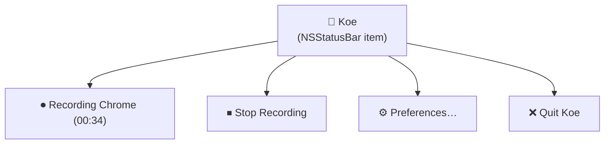
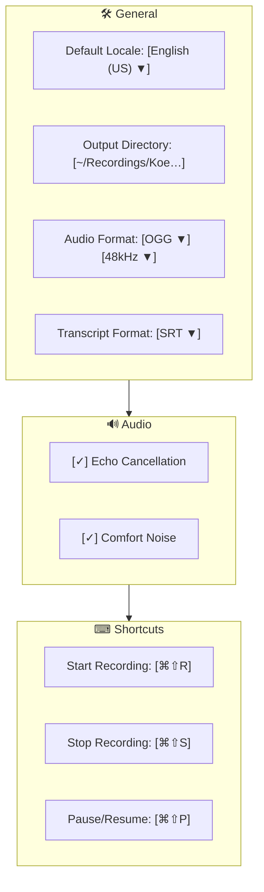

# 09 — GUI Interface (`koe-gui`)

## Technology: GPUI

`koe-gui` uses **[GPUI](https://github.com/zed-industries/zed)** (Zed's
GPU-accelerated Rust UI framework). GPUI is a retained-mode, GPU-rendered
framework with:

- **Metal-backed rendering** on macOS — native performance, low CPU overhead
- **AppKit window shell** — GPUI windows are real NSWindows with proper
  mission control / stage manager integration
- **First-class async** — all UI actions are async tasks; no blocking the
  render thread
- **Rust-native** — no Swift, no Xcode, no storyboards. The entire GUI is in Rust.

### Why GPUI over SwiftUI?

| Concern | SwiftUI (previous design) | GPUI |
|---------|--------------------------|------|
| Language split | Swift + Rust, two build systems | Pure Rust, one build system |
| FFI surface for GUI state | Large: every UI state change crosses FFI | Minimal: only native capture/ASR FFI |
| Live transcript view | NSTableView wrapping, AppKit bridging | Pure GPUI `List` / `UniformList` |
| Waveform rendering | Custom `NSView` + CoreAnimation | GPUI `Canvas` + direct Metal path |
| Build complexity | Xcode + xcframework + cargo | `cargo build` only |
| Debugging | Two debuggers (lldb for Swift, rust-lldb for Rust) | Single debugger |
| macOS minimum | Same (macOS 14+ for SFSpeechAnalyzer) | Same |
| Notarization | `.app` bundle with Swift runtime | `.app` bundle with Rust binary; simpler |
| Maturity | Stable, first-party | Beta-quality, tied to Zed's release cycle |

The critical advantage: **GUI state management lives in Rust** alongside
the pipeline. Audio level data flows from `koe-core` directly into GPUI
rendering without serializing across an FFI bridge.

## Architecture



## Window Structure



### Key Views

| View | GPUI Element | Description |
|------|-------------|-------------|
| Title bar | `Titlebar` | Native traffic-light buttons, custom title |
| Audio meters | `Canvas` | GPU-rendered level bars, 60 fps from `koe-core` level stream |
| Source panel | `List` + `Button` | Shows active capture sources with per-source level indicators |
| Live transcript | `UniformList` | Virtual scrolling list of transcript segments |
| Segment row | `Label` + `div` | Timestamp + text; partial segments in italic/gray |
| Control bar | `div` + `Button` | Record/pause/stop transport with duration and file size |
| Content picker | `Modal` + `List` | SCK SCShareableContent browser (backed by native call) |

## Data Flow: Rust → GPU

GPUI renders on the main thread using Metal. Audio level data feeds into the
render loop as follows:



This is a **single-channel, single-language** path — no FFI for UI updates.
The only FFI is for the initial capture/ASR setup via `koe-ffi`.

## Permissions UX (GPUI)

```
 App Launch → 🖥️ Welcome dialog

   🎤 Microphone       [Authorize]  → AVCaptureDevice.requestAccess()
   🖥 Screen Recording  [Authorize]  → CGRequestScreenCaptureAccess()
   ♿ Accessibility     [Open Settings] → NSWorkspace.open(System Preferences)
```

- Microphone: GPUI calls into `koe-ffi → koe-native` which triggers
  `AVCaptureDevice.requestAccess(for: .audio)`. On macOS, this displays a
  system TCC alert attached to the Koe window.
- Screen Recording: Koe calls `CGRequestScreenCaptureAccess()` which presents
  the system dialog. Alternatively, opening the SCK content picker implicitly
  triggers the prompt.
- Accessibility: Koe opens `x-apple.systempreferences:com.apple.preference.security?Privacy_Accessibility`
  via `NSWorkspace.open(_:)`. A GPUI `Button` triggers this via the native
  shim. The view polls `AXIsProcessTrusted()` every 2 seconds and updates when
  granted.

## System Tray / Menu Bar App (v1 Stretch)



A minimal `NSStatusBar` item owned by the GPUI app. Recording can be started
and stopped from the menu bar without bringing the main window into focus.
This is implemented as a thin native shim (`koe-native` provides a
`StatusBarController`), since GPUI does not yet expose NSStatusBar APIs.

## Preferences Window



GPUI `TextInput`, `Checkbox`, `Dropdown` (custom or via GPUI primitives),
`List` for the preference tabs.

## Global Hotkey

```rust
// koe-gui/src/hotkey.rs (sketch)

use koe_ffi::{start_recording, stop_recording, AudioSourceConfig};

// Register with Carbon Event Manager via koe-native shim
// GPUI schedules the handler on its main thread via cx.spawn()

pub fn register_hotkeys(cx: &mut gpui::Context<AppModel>) {
    // ⌘⇧R → start recording from last-used source
    // ⌘⇧S → stop
    // ⌘⇧P → toggle pause
    // Uses RegisterEventHotKey (Carbon) via koe-native
}
```

Hotkey registration goes through a native shim (Carbon Event Manager still
works on macOS 14+), with the handler posting to the GPUI event loop via a
channel.

## Build & Bundle

```
cargo build --release -p koe-gui
# Produces: target/release/koe-gui (Mach-O binary)

# Bundle into .app:
mkdir -p Koe.app/Contents/MacOS
mkdir -p Koe.app/Contents/Resources
cp target/release/koe-gui Koe.app/Contents/MacOS/Koe
cp koe-gui/Info.plist Koe.app/Contents/
cp koe-gui/Assets.xcassets/AppIcon.icns Koe.app/Contents/Resources/

# Embed koe-native as a framework:
cp -R target/release/libkoe_native.dylib Koe.app/Contents/Frameworks/

# Sign and notarize:
codesign --deep --force --verify --sign "Developer ID" Koe.app
xcrun notarytool submit Koe.app --apple-id ... --team-id ... --wait
```

## GPUI Versions and Stability

GPUI is tightly coupled to Zed's development cadence. Koe pins a specific GPUI
revision via Cargo `[patch]` or a direct git dependency. Upgrade strategy:

- Pin a known-good Zed release tag (e.g., `v0.140.0`)
- Test on each macOS major release
- Upgrade GPUI only when a new Zed stable is available and tested

```toml
# Cargo.toml (koe-gui)
[dependencies]
gpui = { git = "https://github.com/zed-industries/zed", rev = "..." }
```

GPUI exposes these features we depend on:
- `gpui::Window` — NSWindow shell
- `gpui::Canvas` — Metal-backed custom rendering (waveform, level meter)
- `gpui::UniformList` — virtual scrolling (transcript segments)
- `gpui::text` — text layout (no external text shaping dep)
- `gpui::actions` — keyboard shortcut dispatch
- `gpui::px` / `gpui::rem` — DPI-aware measurement

## Limitations

1. **Accessibility:** GPUI's accessibility bridge is minimal compared to
   AppKit/SwiftUI. Screen reader support for transcript text may be limited.
2. **Text editing:** Transcript view is read-only in v1. GPUI's text input
   support is evolving but sufficient for preferences.
3. **Theme:** GPUI's theme system is designed for code editors. Koe provides a
   simplified wrapper with light/dark variants.
4. **Menus:** GPUI does not expose `NSMenu` natively. The menu bar (File,
   Edit, etc.) is minimal; preferences and quit are toolbar buttons.
