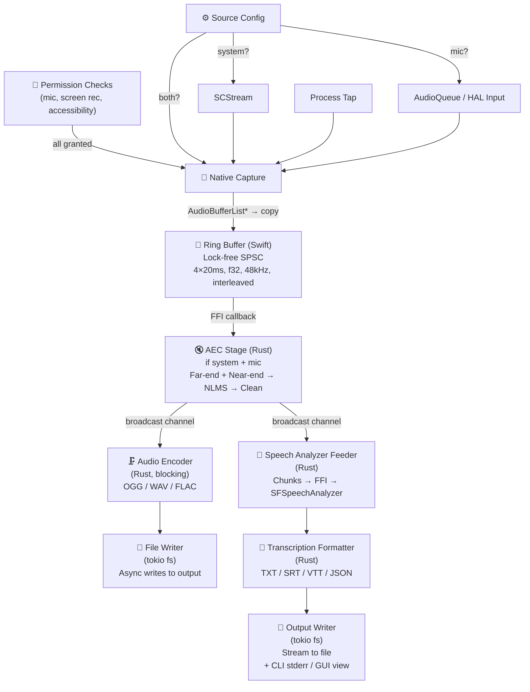
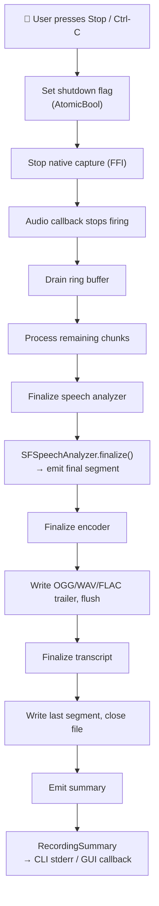
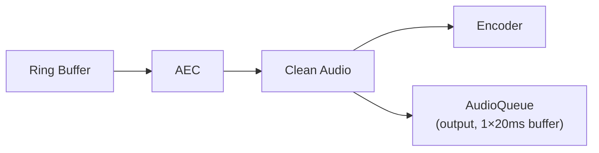

# 10 — Recording Pipeline

## End-to-End Data Flow



## Ring Buffer Design

The ring buffer is the only shared-memory point between the native audio
callback and the Rust consumer. It lives in `koe-native` (Swift) because the
native callback requires lock-free allocation from a pre-registered region.

```swift
// koe-native/Sources/AudioTap/RingBuffer.swift

public final class RingBuffer {
    private let storage: UnsafeMutableBufferPointer<Float>
    private let capacity: Int           // in frames
    private var writeIndex: AtomicInt   // OSAtomicInt / stdatomic
    private var readIndex: AtomicInt

    public init(frameCapacity: Int, channelCount: Int = 2) { /* ... */ }

    /// Called from the real-time audio callback. Never blocks.
    /// - Returns: true if the write succeeded, false if the buffer is full (drop).
    @inline(__always)
    public func write(_ frames: UnsafePointer<Float>, count: Int) -> Bool {
        let available = availableWriteCapacity
        guard count <= available else { return false }

        let writePos = writeIndex.load(ordering: .relaxed) % capacity
        let firstChunk = min(count, capacity - writePos)
        storage.baseAddress!.advanced(by: writePos * channelCount)
            .assign(from: frames, count: firstChunk * channelCount)
        if firstChunk < count {
            storage.baseAddress!.assign(
                from: frames.advanced(by: firstChunk * channelCount),
                count: (count - firstChunk) * channelCount
            )
        }
        writeIndex.store((writePos + count) % capacity, ordering: .release)
        return true
    }

    /// Called from Rust via FFI (non-real-time).
    /// - Returns: number of frames read, or 0 if empty.
    public func read(into buffer: UnsafeMutablePointer<Float>, maxFrames: Int) -> Int {
        // ...
    }
}
```

Properties:

| Parameter | Value | Rationale |
|-----------|-------|-----------|
| Capacity | 7680 frames × 2 ch = 61,440 floats | 4 × 20 ms at 48 kHz (960 frames × 4 = 3840 frames); ×2 for safety margin |
| Memory | ~240 KB | Negligible |
| Write cost | 1 `memcpy` + 2 atomic ops | ~1 µs on M-series |
| Drop behavior | Return `false`, increment drop counter | No blocking; consumer sees gap |

## Pipeline Lifecycle

```rust
// koe-core/src/pipeline.rs (sketch)

pub struct RecordingPipeline {
    config: PipelineConfig,
    state: PipelineState,
    aec: Option<AcousticEchoCanceller>,
    encoder: AudioEncoder,
    speech: SpeechAnalyzerBridge,
    transcript_fmt: TranscriptFormatter,
    file_writer: FileWriter,
    drop_counter: Arc<AtomicU64>,
}

pub enum PipelineState {
    Idle,
    Recording {
        start_time: Instant,
        bytes_written: u64,
        segments: Vec<TranscriptionSegment>,
    },
    Paused {
        elapsed_before_pause: Duration,
    },
    Stopped,
}

impl RecordingPipeline {
    pub async fn start(config: PipelineConfig) -> Result<Self, PipelineError> {
        // 1. Validate config
        // 2. Open output files
        // 3. Initialize encoder
        // 4. Initialize speech analyzer
        // 5. Create ring buffer
        // 6. Start native capture (ffi call)
        // 7. Spawn consumer tasks
        Ok(Self { /* ... */ })
    }

    pub async fn stop(&mut self) -> Result<RecordingSummary, PipelineError> {
        // 1. Signal native capture to stop
        // 2. Drain ring buffer (process remaining frames)
        // 3. Finalize speech analyzer (flush partial segment)
        // 4. Finalize encoder (write trailer / finalize OGG stream)
        // 5. Flush and close files
        // 6. Return summary
    }

    pub fn pause(&mut self) {
        // 1. Signal native capture to pause (stop producing, keep tap alive)
        // 2. Pause encoder
        // 3. Do NOT finalize speech analyzer (expect resume)
    }

    pub fn resume(&mut self) {
        // 1. Signal native capture to resume
        // 2. Resume encoder
        // 3. Speech analyzer resumes transparently (stream continues)
    }
}
```

## Consumer Task Loop

```rust
// koe-core/src/pipeline/consumer.rs (sketch)

async fn consumer_loop(
    mut rx: tokio::sync::broadcast::Receiver<AudioChunk>,
    encoder: Arc<Mutex<AudioEncoder>>,
    speech: Arc<SpeechAnalyzerBridge>,
    writer: Arc<FileWriter>,
) {
    loop {
        match rx.recv().await {
            Ok(chunk) => {
                // Encode: blocking work → spawn_blocking
                let encoded = tokio::task::spawn_blocking({
                    let encoder = encoder.clone();
                    move || encoder.lock().unwrap().encode(&chunk.samples)
                }).await.unwrap();

                // Write to disk
                writer.write(&encoded).await;

                // Feed to speech analyzer (non-blocking, native side buffers)
                speech.feed_audio(&chunk.samples);

                // Emit progress for CLI/GUI
                // (via a separate broadcast channel)
            }
            Err(tokio::sync::broadcast::error::RecvError::Lagged(n)) => {
                log::warn!("Consumer lagged by {} chunks; audio dropped", n);
                // Heal: skip ahead, no recovery possible for lost audio
            }
            Err(tokio::sync::broadcast::error::RecvError::Closed) => {
                break; // Pipeline shutting down
            }
        }
    }
}
```

## Shutdown Sequence



The shutdown sequence must complete within 2 seconds of user request. In
practice, with a small ring buffer, draining takes < 100 ms.

## Monitoring (Pass-Through)

When `--monitor` (CLI) or "Monitor" toggle (GUI) is enabled, the clean audio
(after AEC, before encoding) is routed to the default audio output device:



This uses a minimal `AudioQueue` instance created at pipeline start and
destroyed at stop. Latency is one block (~5 ms) plus output device buffer
(~10 ms) = ~15 ms total monitoring latency.

## Error Recovery

| Failure | Recovery |
|---------|----------|
| Ring buffer overflow | Increment drop counter; consumer sees gap; resume normal operation on next available chunk |
| Encoder error (disk full) | Pause pipeline; emit `StorageFull` error; user frees space → resume |
| Speech analyzer error | Log error; transcription stops; audio recording continues (non-fatal) |
| Native capture stream broken (app quit) | Drain pipeline; finalize with partial results |
| AEC filter divergence | Reset filter coefficients; log event; transient echo until reconvergence |

## Metrics & Telemetry

Koe is offline-first and collects **no telemetry**. However, the pipeline
emits internal metrics for debugging:

```rust
pub struct PipelineMetrics {
    pub total_frames_processed: u64,
    pub dropped_frames: u64,
    pub aec_erle_db: f32,          // Echo Return Loss Enhancement
    pub encoder_bitrate_bps: f32,
    pub speech_segment_count: u64,
    pub avg_segment_latency_ms: f32, // Time from audio capture to transcript output
}
```

`--metrics` flag (CLI) or "Show Metrics" (GUI debug menu) dumps these at
stop. No file is written unless requested.
