# Koe — Implementation Task Breakdown

This directory contains a detailed task breakdown derived from `docs/spec/`.
Each task is one file, designed to be independently implementable and
verifiable. Tasks are numbered by logical dependency order.

## Task Map

### Phase 1: Foundation (01–02)

| # | Task | Depends On | Crates |
|---|------|-----------|--------|
| 01 | [Workspace Setup](./01-workspace-setup.md) | — | all |
| 02 | [koe-native Swift Package](./02-koe-native-package.md) | 01 | koe-native |

### Phase 2: Native Layer — Infrastructure (03–06)

| # | Task | Depends On | Crates |
|---|------|-----------|--------|
| 03 | [Permission Checker](./03-permission-checker.md) | 02 | koe-native |
| 04 | [Ring Buffer](./04-ring-buffer.md) | 02 | koe-native |
| 05 | [Audio Format Normalization](./05-audio-format-normalization.md) | 02 | koe-native |
| 06 | [Process Enumeration](./06-process-enumeration.md) | 02 | koe-native |

### Phase 3: Native Layer — Capture & ASR (07–10)

| # | Task | Depends On | Crates |
|---|------|-----------|--------|
| 07 | [Core Audio Process Tap](./07-core-audio-process-tap.md) | 04, 05 | koe-native |
| 08 | [ScreenCaptureKit Audio Capture](./08-screen-capture-kit-capture.md) | 04, 06 | koe-native |
| 09 | [Microphone Capture](./09-microphone-capture.md) | 03, 04 | koe-native |
| 10 | [Speech Analyzer Bridge](./10-speech-analyzer-bridge.md) | 02 | koe-native |

### Phase 4: FFI Layer (11–14)

| # | Task | Depends On | Crates |
|---|------|-----------|--------|
| 11 | [uniffi Configuration & Build](./11-uniffi-setup.md) | 01, 02 | koe-ffi |
| 12 | [FFI Core Exports](./12-ffi-core-exports.md) | 03, 07–10, 11 | koe-ffi |
| 13 | [FFI Error Types](./13-ffi-error-types.md) | 12 | koe-ffi |
| 14 | [FFI Callback Interfaces](./14-ffi-callback-interfaces.md) | 12 | koe-ffi |

### Phase 5: Core Library — Pipeline & Processing (15–23)

| # | Task | Depends On | Crates |
|---|------|-----------|--------|
| 15 | [Pipeline Core](./15-pipeline-core.md) | 12, 13, 14 | koe-core |
| 16 | [Consumer Task Loop](./16-consumer-task-loop.md) | 15 | koe-core |
| 17 | [AudioEncoder Trait & OGG](./17-audio-encoder-trait-and-ogg.md) | 15 | koe-core |
| 18 | [WAV Encoder](./18-wav-encoder.md) | 17 | koe-core |
| 19 | [FLAC Encoder](./19-flac-encoder.md) | 17 | koe-core |
| 20 | [Transcript Formatter](./20-transcript-formatter.md) | 15 | koe-core |
| 21 | [Echo Cancellation (AEC)](./21-echo-cancellation.md) | 15 | koe-core |
| 22 | [Shutdown Sequence](./22-shutdown-sequence.md) | 15, 16 | koe-core |
| 23 | [Audio Monitoring](./23-audio-monitoring.md) | 15 | koe-core |

### Phase 6: CLI (24–30)

| # | Task | Depends On | Crates |
|---|------|-----------|--------|
| 24 | [`koe record` Command](./24-cli-record-command.md) | 15, 17, 20, 21 | koe-cli |
| 25 | [`koe list` Command](./25-cli-list-command.md) | 06, 12 | koe-cli |
| 26 | [`koe transcribe` Command](./26-cli-transcribe-command.md) | 10, 20 | koe-cli |
| 27 | [`koe permissions` & `koe info`](./27-cli-permissions-and-info.md) | 03, 12 | koe-cli |
| 28 | [Config File Loading](./28-cli-config-file.md) | 24 | koe-cli |
| 29 | [Signal Handling](./29-cli-signal-handling.md) | 22, 24 | koe-cli |
| 30 | [Progress Output](./30-cli-progress-output.md) | 24 | koe-cli |

### Phase 7: GUI (31–41)

| # | Task | Depends On | Crates |
|---|------|-----------|--------|
| 31 | [GPUI App Scaffold](./31-gui-gpui-scaffold.md) | 01 | koe-gui |
| 32 | [Audio Level Meters](./32-gui-audio-meters.md) | 15, 31 | koe-gui |
| 33 | [Source Panel](./33-gui-source-panel.md) | 06, 31 | koe-gui |
| 34 | [Live Transcript View](./34-gui-live-transcript.md) | 20, 31 | koe-gui |
| 35 | [Control Bar (Transport)](./35-gui-control-bar.md) | 15, 31 | koe-gui |
| 36 | [Content Picker](./36-gui-content-picker.md) | 08, 31 | koe-gui |
| 37 | [Permissions UX](./37-gui-permissions-ux.md) | 03, 31 | koe-gui |
| 38 | [Preferences Window](./38-gui-preferences.md) | 31 | koe-gui |
| 39 | [Global Hotkeys](./39-gui-global-hotkeys.md) | 31 | koe-gui |
| 40 | [Status Bar (v1 Stretch)](./40-gui-status-bar.md) | 31 | koe-gui |
| 41 | [Theme System](./41-gui-theme.md) | 31 | koe-gui |

### Phase 8: Integration & Polish (42–47)

| # | Task | Depends On | Crates |
|---|------|-----------|--------|
| 42 | [Pipeline Metrics](./42-pipeline-metrics.md) | 15 | koe-core |
| 43 | [Disk Space Validation](./43-disk-space-check.md) | 15 | koe-core |
| 44 | [Error Recovery](./44-error-recovery.md) | 15, 22 | koe-core |
| 45 | [Integration Tests](./45-integration-tests.md) | 15, 17, 20, 21 | all |
| 46 | [Packaging & Notarization](./46-packaging-notarization.md) | 24, 31 | koe-gui |
| 47 | [Documentation](./47-documentation.md) | all | docs |

## Dependency Graph

```mermaid
graph TD
    subgraph Foundation
        01[01-workspace-setup]
        02[02-koe-native-package]
    end

    subgraph Native-Infrastructure
        03[03-permission-checker]
        04[04-ring-buffer]
        05[05-format-normalization]
        06[06-process-enumeration]
    end

    subgraph Native-Capture
        07[07-core-audio-process-tap]
        08[08-screen-capture-kit]
        09[09-microphone-capture]
        10[10-speech-analyzer-bridge]
    end

    subgraph FFI
        11[11-uniffi-setup]
        12[12-ffi-core-exports]
        13[13-ffi-error-types]
        14[14-ffi-callback-interfaces]
    end

    subgraph Core
        15[15-pipeline-core]
        16[16-consumer-task-loop]
        17[17-audio-encoder-trait-and-ogg]
        18[18-wav-encoder]
        19[19-flac-encoder]
        20[20-transcript-formatter]
        21[21-echo-cancellation]
        22[22-shutdown-sequence]
        23[23-audio-monitoring]
    end

    subgraph CLI
        24[24-cli-record-command]
        25[25-cli-list-command]
        26[26-cli-transcribe-command]
        27[27-cli-permissions-and-info]
        28[28-cli-config-file]
        29[29-cli-signal-handling]
        30[30-cli-progress-output]
    end

    subgraph GUI
        31[31-gui-gpui-scaffold]
        32[32-gui-audio-meters]
        33[33-gui-source-panel]
        34[34-gui-live-transcript]
        35[35-gui-control-bar]
        36[36-gui-content-picker]
        37[37-gui-permissions-ux]
        38[38-gui-preferences]
        39[39-gui-global-hotkeys]
        40[40-gui-status-bar]
        41[41-gui-theme]
    end

    subgraph Integration
        42[42-pipeline-metrics]
        43[43-disk-space-check]
        44[44-error-recovery]
        45[45-integration-tests]
        46[46-packaging-notarization]
        47[47-documentation]
    end

    01 --> 02
    02 --> 03 & 04 & 05 & 06 & 10
    04 --> 07 & 08 & 09
    05 --> 07
    06 --> 08
    03 --> 09
    01 --> 11
    02 --> 11
    03 & 07 & 08 & 09 & 10 --> 12
    11 --> 12
    12 --> 13 & 14
    12 & 13 & 14 --> 15
    15 --> 16 & 17 & 20 & 21 & 22 & 23 & 42 & 43 & 44
    17 --> 18 & 19
    15 & 17 & 20 & 21 --> 24
    06 & 12 --> 25
    10 & 20 --> 26
    03 & 12 --> 27
    24 --> 28
    22 & 24 --> 29
    24 --> 30
    01 --> 31
    15 & 31 --> 32
    06 & 31 --> 33
    20 & 31 --> 34
    15 & 31 --> 35
    08 & 31 --> 36
    03 & 31 --> 37
    31 --> 38 & 39 & 40 & 41
    15 & 17 & 20 & 21 --> 45
    24 & 31 --> 46
```

## Quick-Start (for implementors)

1. Start with Phase 1 (01–02) to set up the workspace and build infrastructure.
2. Follow the dependency graph — tasks within a phase can be parallelized
   when their `depends` are satisfied.
3. Each task file contains a **Verification** section — use this as your
   acceptance criteria.
4. Spec references (`spec_refs` in each task's frontmatter) link back to the
   design documents in `docs/spec/`.
