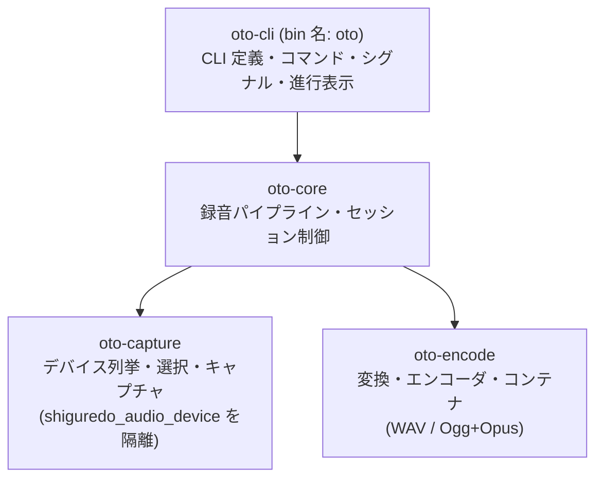
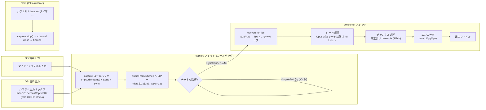

# 02 — アーキテクチャ

## クレート構成

**トピック単位で 4 クレートに分割**する(リポジトリの koe/sui と同じ流儀)。分割理由は
FFI/GUI のためではなく(oto には無い)、以下を実現するため:

- **プラットフォーム依存の隔離**: shiguredo_audio_device とターゲット別 feature は
  `oto-capture` に閉じ込める。他のクレートはプラットフォームを意識しない。
- **ヘッドレステスト性**: 純ロジック(変換・エンコード・コンテナ)を `oto-encode` に置き、
  デバイスなしで網羅テストできる。
- **一方向依存・循環なし**: `oto-cli → oto-core → {oto-capture, oto-encode}`。



```
oto/
├── oto-capture/    # デバイス・キャプチャ(leaf)
│   └── src/
│       ├── lib.rs        # 公開 API、AudioFrameOwned の再エクスポート
│       ├── device.rs     # enumerate_input、デバイス選択(unique_id 完全一致 → name 部分一致)
│       ├── capture.rs    # CaptureSession: AudioCapture 構築・開始/停止
│       └── system.rs     # SystemCaptureSession: システム出力ミックス(ループバック)
│           └── macos.rs  #   macOS: ScreenCaptureKit(capturesAudio、ドライバ不要)
├── oto-encode/     # 変換・エンコード・コンテナ(leaf、ヘッドレステスト対象)
│   └── src/
│       ├── lib.rs        # AudioEncoder トレイト、EncoderSpec/Stats、EncoderKind
│       ├── convert.rs    # S16/F32→i16、ダウンミックス、レート判定・リサンプル(rubato)
│       ├── wav.rs        # WAV ライタ
│       └── ogg_opus.rs   # Opus エンコーダ + Ogg ページライタ(RFC 7845)
├── oto-core/       # 録音パイプライン
│   └── src/
│       ├── lib.rs        # RecordingSession(パイプライン公開 API)
│       ├── pipeline.rs   # バウンドチャネル、drop-oldest、コンシューマスレッド
│       └── recorder.rs   # RecordingSession: capture + encode の組み立て、停止シーケンス、統計
├── oto-cli/        # バイナリ(bin 名: oto)
│   └── src/
│       ├── main.rs       # エントリポイント。MainError → 終了コード
│       ├── cli.rs        # jdx/usage (usage-rs) による CLI 定義
│       ├── list.rs       # oto list
│       ├── record.rs     # oto record(進行表示・サマリ)
│       └── signal.rs     # SIGINT/SIGTERM と二度押し強制終了(tokio::signal)
├── package.nix     # flake 用パッケージ定義(koe/sui パターン)
├── nix/patches/
│   └── shiguredo_opus-prebuilt.patch
└── docs/spec/
```

トレイト `AudioEncoder`(oto-encode に定義、koe-core の `AudioEncoder` と同コンセプト):

```rust
trait AudioEncoder: Send {
    /// エンコーダの前提条件(レート/チャンネル)を返す。
    fn spec(&self) -> EncoderSpec;
    /// インターリーブ i16 PCM を書き込む(チャンク境界は任意)。
    fn write_pcm(&mut self, pcm: &[i16]) -> Result<()>;
    /// 残余バッファを処理し、コンテナを確定する(ヘッダ書き戻し / 最終ページ)。
    fn finalize(&mut self) -> Result<EncoderStats>;
}
```

- WAV: `write_pcm` は到着分をそのまま書き込む(任意サイズ)。
- Ogg/Opus: `frame_samples` 分をバッファリングしてから 1 パケットずつエンコードする。

workspace への登録は koe/sui と同様に `[workspace.dependencies]` への path 依存 + members 追加で行う
(05、07 参照)。

## データフロー



- **capture スレッド**: `shiguredo_audio_device::AudioCapture`(マイク)または
  `SystemCaptureSession`(システム出力ミックス)のコールバックが実行される。ここでやるのは
  `frame.to_owned()` と `SyncSender` への送信のみ(ファイル I/O・エンコードはしない)。
  リアルタイム性を壊さないためブロックしない。
- **ソース抽象**: `oto-capture::SystemCaptureSession` は `CaptureSession` と同じ
  `AudioFrameOwned` ストリームと `sample_rate/channels/dropped/stop` 面を持つため、
  コンシューマ・エンコーダ層はソースを意識しない。`RecordingConfig.source` で
  `AudioSource::{Microphone, System}` を選ぶだけ。
- **コンシューマスレッド**: 受信した `AudioFrameOwned` を変換し、エンコーダに渡す。
  エンコーダはコンシューマスレッドが所有する(スレッド間共有なし、`mut` のみ)。
- **main**: tokio runtime 上でシグナルと `--duration` タイマーを待つ。停止時は
  `source.stop()` を呼んでから送信側を drop(チャネル close)し、コンシューマが残余を
  処理して `finalize()` するのを待つ。

## バッファリング方針

- チャネルは `std::sync::mpsc::sync_channel`(バウンド、既定 32 フレーム)。
  満杯時は **drop-oldest**(送信側で最新を生かす)。オーディオスレッドをブロックしない。
- ドロップ数は `AtomicUsize` で計数し、`finalize` 後のサマリで警告する(例: `3 frames dropped`)。

## 停止シーケンス(異常系含む)

| イベント | 動作 | 終了コード |
|---|---|---|
| SIGINT 1 回目 / SIGTERM | `capture.stop()` → チャネル close → 残余処理 → `finalize()` → サマリ表示 | 0 |
| SIGINT 2 回目(2 秒以内) | 即 `process::exit(5)`(ファイルは未確定の可能性あり) | 5 |
| `--duration <secs>` 満了 | シグナルと同じ正常停止 | 0 |
| デバイスエラー / I/O エラー | エラー表示、可能なら `finalize()` | 1–4(下表) |

`MainError` と終了コードは koe-cli と同一の割り当てに揃える(03 参照)。

## エラー設計

```rust
#[derive(Debug, Error)]
enum MainError {
    InvalidArgs(String),   // 2: 引数エラー(usage パース失敗も含む)
    Capture(String),       // 3: デバイス列挙/キャプチャ構築・開始失敗
    Io(String),            // 4: ファイル書き込み失敗
    Interrupted,           // 5: Ctrl-C(強制終了は exit(5))
    Internal(String),      // 6: その他
}
```

エラー表示は `eprintln!("{err}")` + 終了コード(カラーリングは行わない。`color-eyre` は使わない)。

## コンフィグ

フラグのみ(設定ファイルなし)。`record` の既定値:

| 項目 | 既定値 |
|---|---|
| 出力ファイル | `oto-YYYYmmdd-HHMMSS.ogg`(カレントディレクトリ、`jiff` で生成) |
| 形式 | 拡張子で判定(`.wav` → WAV、`.ogg`/`.opus` → Opus、それ以外 → Opus 既定)。`--format` で上書き |
| ソース | マイク(`--source system` でシステム出力ミックス) |
| デバイス | デフォルト入力デバイス(`device_id: None`)※ `--source system` では未使用 |
| チャンネル | マイク:1 / システム:2(ステレオ)※実デバイスが返す値に従う |
| サンプルレート | マイク:48 kHz 要求。システム:48 kHz 固定(ScreenCaptureKit 設定) |
| Opus ビットレート | 64 kbps(`--bitrate` で変更) |
| フレーム長 | 20 ms(Opus 既定) |