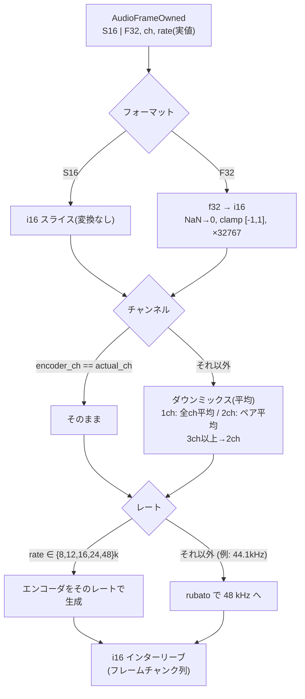

# 04 — エンコードとコンテナ

## 入力データの形

audio-device-rs のキャプチャコールバックが受け取る `AudioFrame` の形(全てプラットフォーム共通):

```rust
pub struct AudioFrame<'a> {
    pub data: &'a [u8],        // インターリーブ PCM のバイト列
    pub frames: i32,           // サンプルフレーム数
    pub channels: i32,         // チャンネル数(実際にデバイスが返した値)
    pub sample_rate: i32,      // 実際のサンプルレート(要求と異なることがある)
    pub format: AudioFormat,   // S16 | F32
    pub timestamp_us: i64,
}
```

- `data` はネイティブエンディアン(対象 3 プラットフォームは全て little-endian)。
  `frame.as_s16()?` / `frame.as_f32()?` で型付きスライスを取り出せる。
- **要求値はあくまで「要求」**: WASAPI 共有モード等では `sample_rate()` / `channels()`
  が config と異なる値を返す。パイプラインは常に「実際の値」を基準に動作する。

## 変換パス (convert.rs)

エンコーダ入力をインターリーブ i16 に統一する(shiguredo_opus の `encode(&[i16])` が i16 入力)。



決定:

- **Opus エンコーダのチャンネル数** = `--channels` 要求(1 または 2、既定 1)。
  実機のチャンネルがそれより多い場合は平均でダウンミックス。WAV はダウンミックスしない
  (実機のチャンネル数のまま記録)。
- **Opus エンコーダのレート** = 実値が Opus 対応レート
  {8000, 12000, 16000, 24000, 48000} ならそのまま、それ以外は 48 kHz にリサンプル(rubato)。
- **WAV のレート/チャンネル** = 実値のまま(変換・リサンプルなし。可逆・無劣化が価値)。

## WAV 形式 (wav.rs)

ヘッダ 44 バイト + PCM データ。形式は入力フォーマットで決まる(変換しない):

| 入力 | WAV 形式 | audio_format | bits |
|---|---|---|---|
| `S16` | PCM 16-bit | 1 | 16 |
| `F32` | IEEE float 32-bit | 3 | 32 |

```
RIFF header: "RIFF" size(36+data_len) "WAVE"
fmt chunk : "fmt " 16  audio_format u16, channels u16, sample_rate u32,
                    byte_rate u32, block_align u16, bits u16
data chunk: "data" size(u32) <PCM…>
```

- オープン時にダミーサイズで書き、`finalize()` でファイル先頭に seek してサイズを書き戻す
  (必ずシーケンシャルな通常ファイルを対象とする)。
- データサイズが u32 上限(約 4 GiB)を超えたら finalize 時に明確なエラーを返す(MVP では分割・
  WAV64 対応なし)。

## Ogg Opus (ogg_opus.rs) — RFC 7845

### エンコーダ設定 (shiguredo_opus)

```rust
let mut encoder = Encoder::new(EncoderConfig {
    bitrate: Some(bitrate_bps),       // 既定 64_000 (--bitrate で変更)
    ..EncoderConfig::new(rate, channels)
})?;
let frame_samples = encoder.frame_samples(); // 既定 20ms → 48kHz で 960
let pre_skip = encoder.get_lookahead()?;     // 既定 312 @48kHz/20ms
```

- `default-features = false`(DRED は不要。オフライン録音では使わない)。
- `encode()` は **ちょうど 1 フレーム分**の i16 を要求する。コンシューマは `frame_samples × channels`
  サンプルを蓄積してから 1 パケット生成する。残余は次チャンクへ持ち越す。

### コンテナ

- **シリアル番号**: `getrandom` で 0 以外の u32。
- **ページ 0(ヘッダ)**: `OpusHead` + `OpusTags` の 2 パケット。

```
OpusHead (19 byte):
  magic "OpusHead"
  version          u8    = 1
  channels         u8    = encoder channels
  pre_skip         u16LE = pre_skip × 48000 / rate   (48kHz ticks)
  input_sample_rate u32LE = rate                      (入力 PCM のレート)
  output_gain      i16LE = 0
  channel_mapping  u8    = 0                          (family 0)

OpusTags:
  magic "OpusTags"
  vendor_len u32LE, vendor "oto <version>"
  count u32LE = 3
  "TITLE=<output filename>", "ENCODER=oto <version>", "CREATED=<ISO-8601 時刻>"
```

- **ページ組立**: `ogg` crate のページライタに 1 パケット/ページで渡す(MVP)。
  ページの granule position は RFC 7845 に従い **48 kHz 単位のサンプル数**で表す:

  ```
  pre_skip48k      = pre_skip × 48000 / rate
  frame_samples48k = frame_samples × 48000 / rate
  granule48k(ページ n) = pre_skip48k + (n+1) × frame_samples48k
  ```

  エンコードレートが 48 kHz の場合は `pre_skip + (n+1) × frame_samples` そのものになり、
  RFC 7845 §4.2 の granularity 要件を自然に満たす。
- **ヘッダページ**: granulepos = 0、先頭ページに BOS。
- **EOS**: 最後のページに EOS フラグ。最終ページの granulepos は直前パケットの値のまま
  (追加のサンプルは足さない)。
- **最終フレームの端数**: 停止時に `frame_samples` に満たない残余は **ゼロパディングして 1 フレーム分**
  エンコードする(末尾に最大 20ms の無音が入るが、granule 計算が整数のまま保たれる)。
- ページオーバーヘッド: 約 58 B/ページ @20ms ≈ 2.9 KB/s。64 kbps 音声に対して ~0.36%。
  MVP では 1 パケット/ページで十分。複数パケット/ページへの詰め込みは将来の最適化。

### なぜ自前ヘッダ + `ogg` クレートか

- koe は自前の Ogg ライタを持つが、Vorbis 専用(`koe-core/src/codec/ogg.rs`)。Opus の
  pre-skip / granule 計算は Vorbis と異なるため流用しない。
- `ogg` crate は純 Rust で CRC/ラシングを実装済み。Opus 固有のヘッダ・granule 計算だけ自前で持つ。

## 統計 (EncoderStats)

`finalize()` は次を返し、CLI がサマリ表示に使う:

```rust
pub struct EncoderStats {
    pub frames: u64,        // 書き込みフレーム数
    pub bytes: u64,         // ファイルサイズ
    pub dropped: u64,       // キャプチャ側で落としたフレーム数
    pub duration_ms: u64,   // frames / actual_rate × 1000
}
```

## レート/ビットレートのバリデーション

- ビットレート: shiguredo_opus の制約 500–512000 bps にクランプし、範囲外は exit 2。
- `--bitrate` は WAV では警告のみ(無視)。
- 実値レートが Opus 対応レート外で、かつリサンプルが失敗した場合は exit 6(内部エラー)。