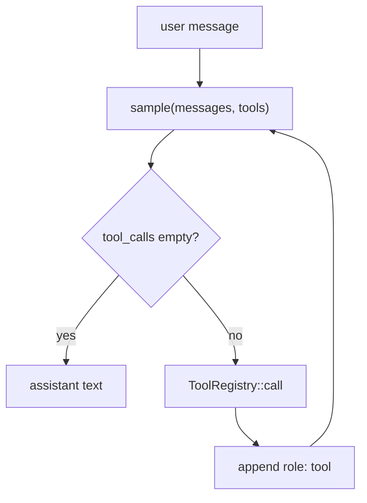
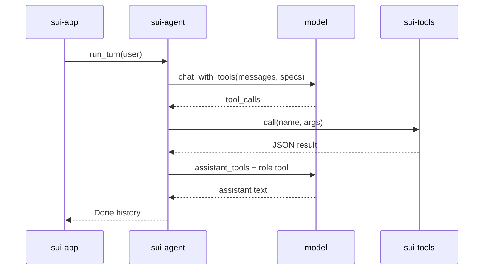
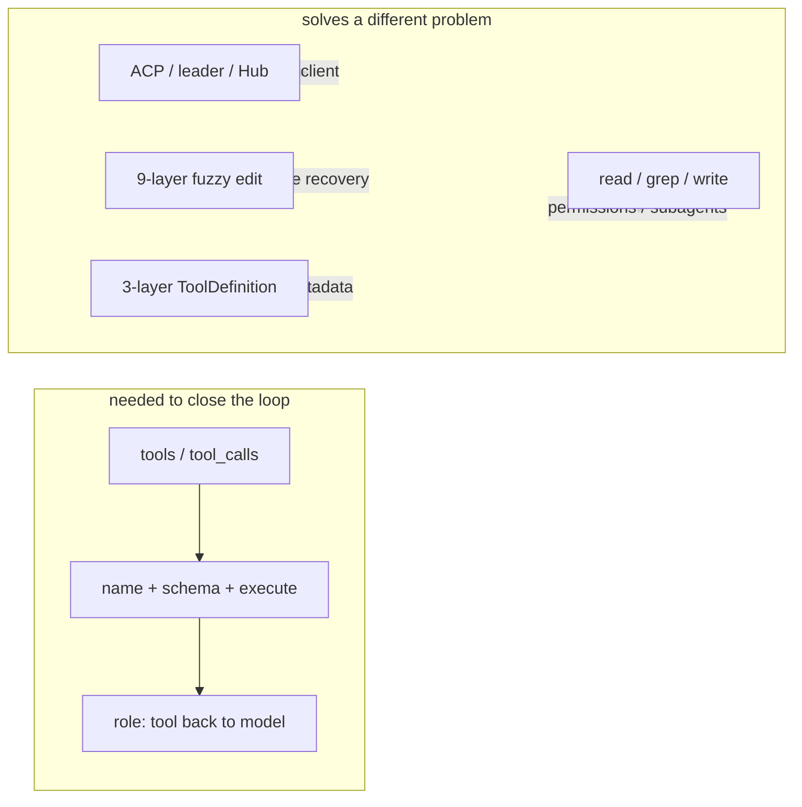
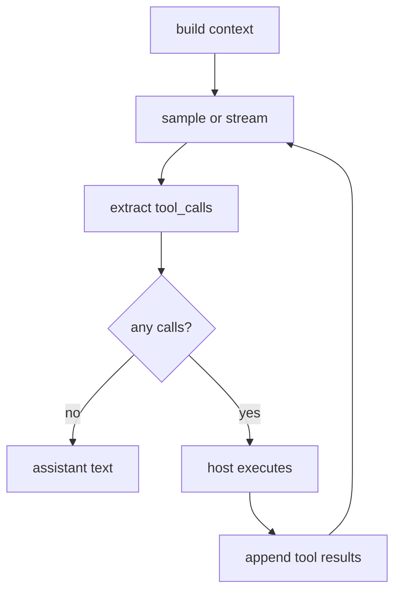
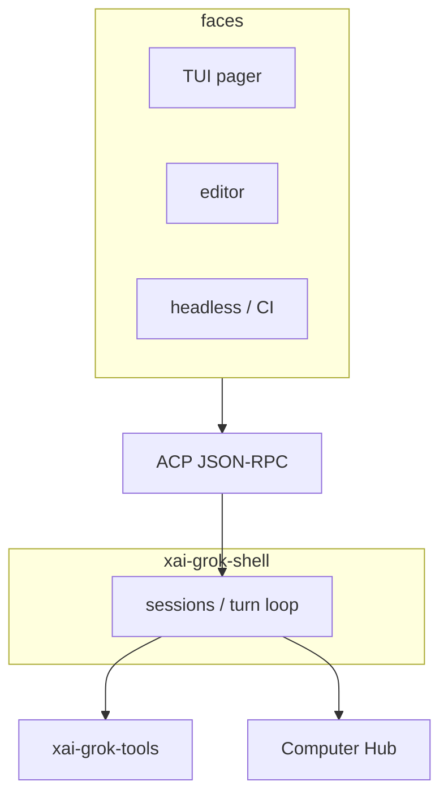
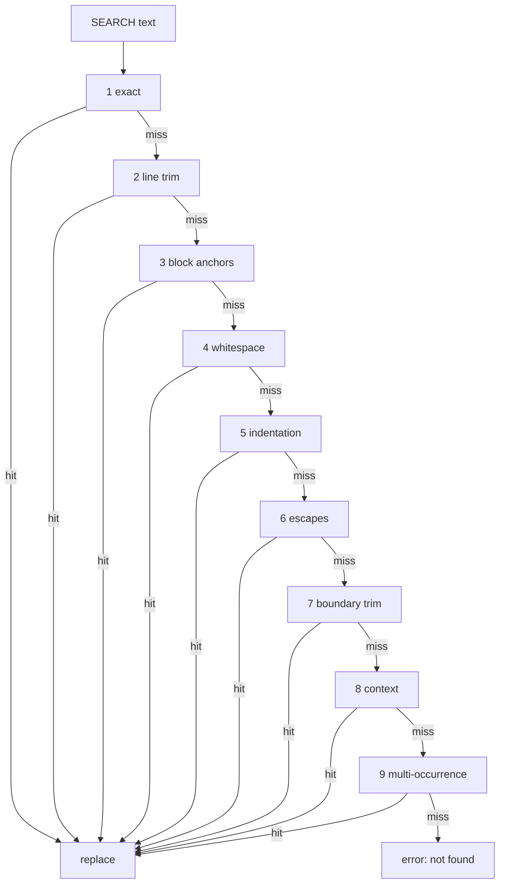
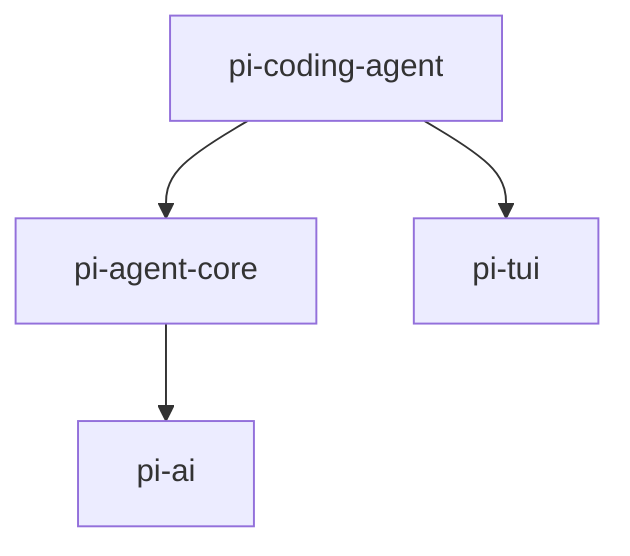
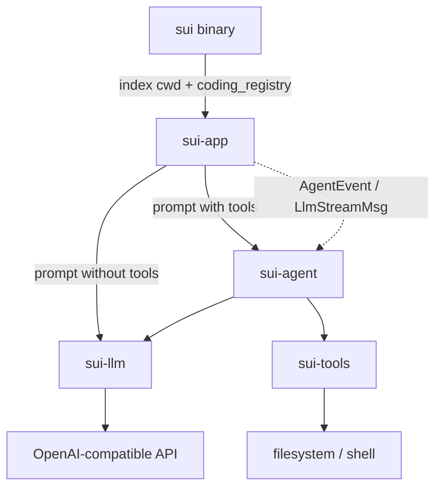
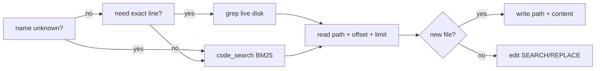
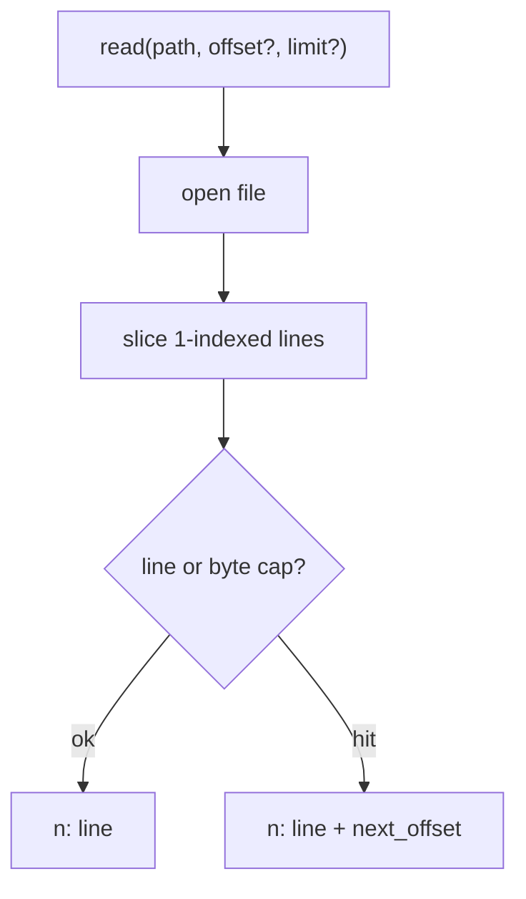

# コーディングエージェントのツール呼び出し

調査対象: Grok Build、OpenCode、pi-agent-core。
実装: `sui-llm` / `sui-tools` / `sui-agent` / `sui-app`。

## 結論

クライアントがファイルシステムやシェルに触るための独自プロトコルは存在しない。
トリガーは **OpenAI 互換の function calling** である。

1. ホストが各 sample に `tools: [{ name, description, parameters }]`（JSON Schema）を載せる。
2. モデルが `finish_reason: tool_calls` と構造化 `tool_calls` を返す。
3. ホストがローカルで実行する（sui では `sui_tools::ToolRegistry::call`）。
4. 結果を `role: tool` メッセージとして履歴に足し、再度 sample する。
5. テキストだけの応答、またはターン上限で止まる。

システムプロンプトは「いつ使うか」だけを短く書く。**どう使うか**はスキーマ側に置く。

sui-llm が OpenAI 互換の Chat Completions / Responses wire format を扱う。
sui-agent はツール呼び出しの抽象だけを利用する。

## 第一原理

「モデルに bash / grep / edit を渡す」と「クライアントが FS / shell に触る」は別の問題に見えるが、分解すると一つになる。

- モデルはトークンしか出せない。ディスクもプロセスも持たない。
- ホストはディスクとプロセスを持っているが、何を実行すべきかは知らない。
- 両者を繋ぐ最小の契約は、**名前付き関数 + JSON 引数 + 実行結果の文字列** である。

この契約より厚いものは、別の問題を解いている。

| 厚い層 | 解いている問題 | ツール実行に必要か |
| --- | --- | --- |
| ACP / leader / Computer Hub | 複数クライアントが一つのエージェントを共有する | 不要 |
| 9 段の fuzzy edit | モデルが空白を少し間違えてもパッチを当てる | 不要（失敗をモデルに返せばよい） |
| 3 層の `ToolDefinition` ラップ | UI ラベル・レンダラ・コア実行を分ける | 不要（既存 `Tool` で足りる） |
| 専用 `grep` / `read` / `write` | 読み取り専用サブエージェントや権限分割 | ループを閉じるには不要。次の改善では足す |

## 3 製品の比較

3 つともループの骨格は同じである。差はループの外側にある。

### 共通ループ

1. コンテキストを組み立てる。
2. モデルに stream / sample する。
3. `tool_calls` を取り出す。
4. ホストが実行する。
5. 結果を履歴に足す。
6. モデルがテキストで止めるまで繰り返す。

### Grok Build

[xai-org/grok-build](https://github.com/xai-org/grok-build) はハーネス全体がプロダクトである。TUI はエージェントの内部 API ではなく、[Agent Client Protocol (ACP)](https://agentclientprotocol.com/) のクライアントとして話す。

- `xai-grok-pager` — TUI（顔）
- `xai-grok-shell` — セッション、ターン、ツール糊、leader
- `xai-grok-tools` — モデルが呼ぶ実装
- Computer Hub — ツール発見・実行・進捗の別プレーン

ACP は「顔」と「脳」のリモコンである。モデルとツールの契約ではない。
sui は単一プロセスの TUI なので、ACP / leader / Hub はコピーしない。
コピーするのは、ツール実装がランタイムと分離している点と、ネイティブ function calling でモデルに道具を見せる点だけである。

### OpenCode

OpenCode も同じ `tools` / `tool_calls` ループを回す。ツール集合は `bash`、`edit`、`read`、`write`、`glob`、`grep`、`list` など。権限は agent 設定の `permission` で `allow` / `ask` / `deny` する。

edit は 9 段の fallback で SEARCH を探す。

これは「モデルが空白を少し間違えてもファイルを壊さず直す」ための最適化である。
曖昧一致は誤置換の原因にもなる（OpenCode 自身の issue でも指摘されている）。
sui の `edit` はバイト完全一致の `SEARCH` / `REPLACE` ブロックである。一致しなければ JSON エラーをモデルに返し、モデルが読み直してやり直す。9 段は後から足せる。最初から持たない。

### pi-agent-core

[pi-mono](https://github.com/badlogic/pi-mono) は層が薄い。

| パッケージ | 役割 |
| --- | --- |
| `pi-ai` | プロバイダ横断の stream |
| `pi-agent-core` | 状態付きループ + ツール実行 |
| `pi-tui` | 描画 |
| `pi-coding-agent` | セッション、skills、組み込みツール |

コアが要求する `AgentTool` は `name` / `description` / `parameters` / `execute` だけである。
`pi-coding-agent` はその上に `ToolDefinition`（ラベル、プロンプト案内、レンダラ）を載せ、`wrapToolDefinition` でコア向けに射影する。

sui はすでに `sui_tools::Tool` が name + description + JSON Schema + `call` を持っている。3 層ラップは削除対象。
pi が後から `read` / `grep` / `write` を足した理由は、読み取り専用サブエージェントと権限分割である。sui はまだサブエージェントを持たない。`code_search` + `edit` + one-shot `bash` でループは閉じる。

## 何を残し、何を捨てたか

Musk の 5 ステップで削った結果。

| 残した | 捨てた / 後回し |
| --- | --- |
| ネイティブ `tools` / `tool_calls` | Grok の ACP / leader / Computer Hub |
| name + description + JSON Schema + execute | OpenCode の 9 段 fuzzy edit |
| 逐次 dispatch。ツール失敗は JSON でモデルへ | pi の 3 層 `ToolDefinition` |
| 短い system prompt。how はスキーマ | 専用 `grep` / `read` / `write` |
| bash のデフォルト `action=run`（新鮮なプロセス） | モデルにパイプセッションを管理させること |
| ターン上限 32、結果 32 768 文字で切る | ツール使用ターンのトークン単位 stream |
| TUI は観察するだけ（`AgentEvent`） | 実行前の permission プロンプト |

「just in case」で残さなかったもの: カスタム XML ツールタグ、独自 trigger プロトコル、ACP 互換レイヤ、edit の曖昧一致。

## sui の配置

責務を 4 crate に分けた。TUI は実行しない。ループは `sui-agent` が所有する。

- `sui`: cwd を BM25 で索引（`rs`, `toml`, `md`, `rhai`）。`App::with_llm` + `App::with_tools(coding_registry)`
- `sui-app`: tools ありなら `agent_spawn`、なしなら `chat_stream_spawn`。`Done` で `chat_history` を置換（楽観的 push しない）
- `sui-agent`: `run_turn` が sample → execute → append を繰り返す
- `sui-llm`: `ToolSpec` / `ToolCall` / `Role::Tool`。`chat_with_tools`
- `sui-tools`: `ToolRegistry::call`。`coding_registry` = `code_search` + `edit` + `bash`（任意）

### ワイヤ（`sui-llm`）

`chat_with_tools` は空の tools スライスなら `tools` フィールド自体を省略する。
assistant メッセージは deprecated な `function_call` を避け、`ChatCompletionRequestAssistantMessage::default()` から `tool_calls` を載せる。
`arguments` はモデルが出した JSON 文字列のまま保持する。再シリアライズで drift させない。

### 実行（`sui-tools`）

`coding_registry` は bash の spawn 失敗で全体を落とさない。search と edit は残る。

`bash` のデフォルトは `run`。`run_line` で新しいプロセスを起こし、終了まで待つ。タイムアウト既定 30s、上限 300s。
セッション操作（`write` / `drain` / `poll` / `wait` / `kill`）は残しているが、明示しないと使われない。モデルにパイプを管理させない。

`edit` はバイト完全一致。`code_search` は BM25。

### ループ（`sui-agent`）

`drive_turn` は非公開。公開入口は `run_turn` / `run_turn_quiet`。

- 未知ツール、非オブジェクト JSON、実行エラー → `{"error": …}` を tool 結果にする。`AgentError` にしない。
- モデルがツールを呼び続けたら `TurnLimit`。
- 結果が長いときは末尾に `\n…(truncated)` を付け、合計を 32 768 文字以下に保つ。

system prompt の要点:

- `code_search` を `ls` より優先
- ファイル変更は `edit`
- シェルは `bash` に 1 行 `command`（action 省略で `run`）
- ユーザーにコマンド実行を頼まない
- ユーザーへの返答は assistant テキスト。`echo` ではない

### TUI（`sui-app` / `sui`）

LLM が設定されているときだけインデックスして `with_tools` する。
最初のエージェントターンで `system_prompt(cwd)` を履歴先頭に入れる。
ツール結果は ghost 行。最終テキストは `Chunk` のあと `Done`。
エージェント sample は非 stream。タイムアウト 10 分。
失敗・中断でユーザー行を pop しないよう、履歴は `Done` の置換だけが正本。

## 次に足すツール

ループは閉じている。足りないのは **正確な読み取り・新規作成・生きたテキスト検索** である。`bash` の `cat` / `rg` / heredoc で代用すると、行番号・上限・gitignore・原子的書き込みが消える。

`code_search` と `grep` は分けた方がよい。質問が違う。

| ツール | 質問 | 今 |
| --- | --- | --- |
| `code_search` | 認証まわりはどこ？（ランキング、スナップショット） | ある |
| `grep` | この文字列は何行目？（正規表現、生きたディスク、gitignore） | なし。`ignore` + 検索 crate で内蔵する |
| `read` | このファイルの N 行から M 行（1始まり、行番号付き、行数とバイトの二重キャップ） | なし。`cat` 代用 |
| `write` | この path に content を書く（新規・上書き） | なし。`edit` は既存の正確な置換だけ |
| `edit` | 既存ファイルのバイト一致置換 | ある |

他エージェントの `read` はほぼ同じ契約に収束している（OpenCode / pi / Claude Code）。

足す順番: `read` → `write` → `grep`。`code_search` は残す。glob / ls は読み取り専用サブエージェントを切るときでよい。

## 検証

- `cargo test --workspace`
- `cargo clippy --workspace --all-targets -- -D warnings`
- `cargo fmt --all`

レビューで直したもの: one-shot bash をモデル向け API にする、`drive_turn` を非公開、ツールエラーを JSON で返す、ターン上限、出力 truncate。

後回し（ループを閉じるのに不要）:

- ツール使用ターンのトークン単位 stream
- 実行前 permission プロンプト
- 専用 `grep` / `read` / `write`（上の「次に足すツール」）
- ACP やサブエージェント

## 参照

- [OpenAI function calling](https://developers.openai.com/api/docs/guides/function-calling.md)
- [Grok Build](https://github.com/xai-org/grok-build)
- [OpenCode edit.ts](https://github.com/anomalyco/opencode/blob/dev/packages/opencode/src/tool/edit.ts)
- [pi-agent-core](https://github.com/badlogic/pi-mono/tree/main/packages/agent)
- 実装: `sui-agent/src/lib.rs`、`sui-llm/src/client.rs`、`sui-tools/src/tool.rs`、`sui-app/src/llm.rs`
