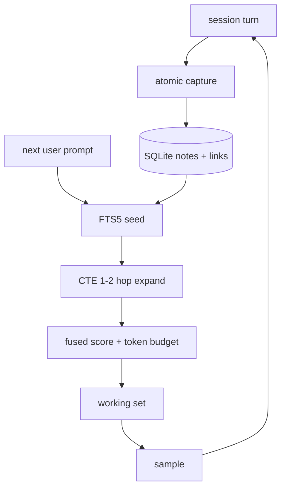
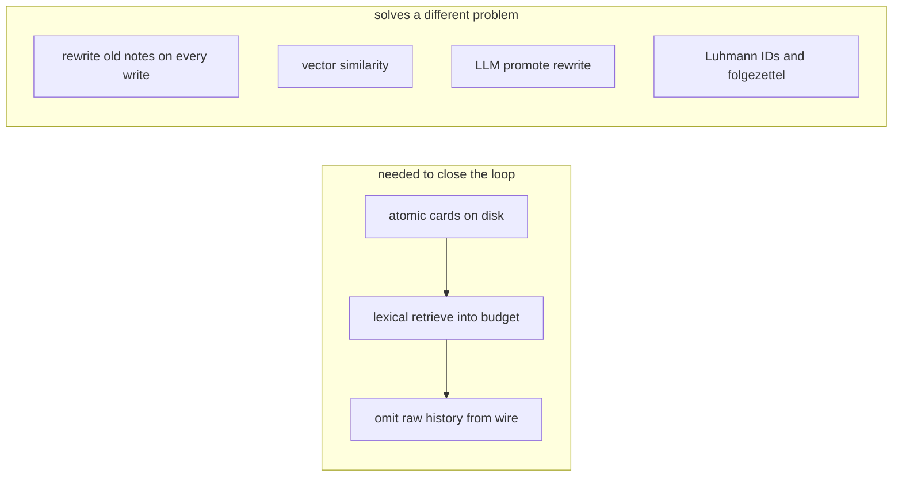
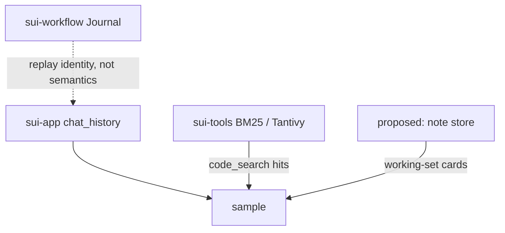
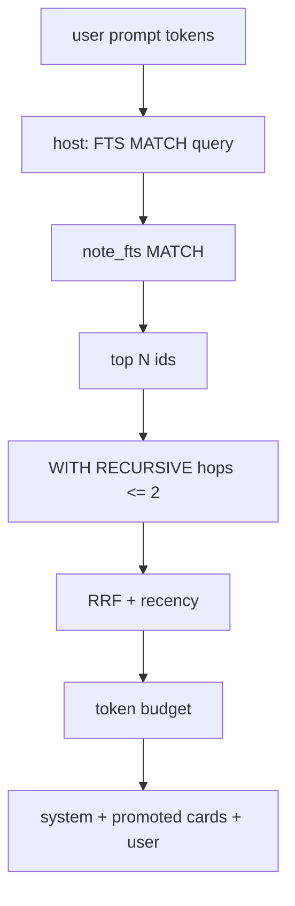
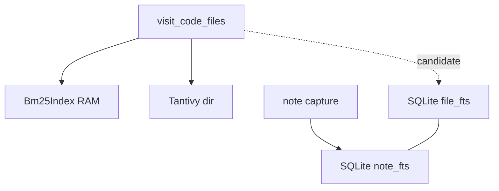
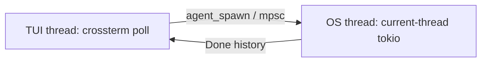
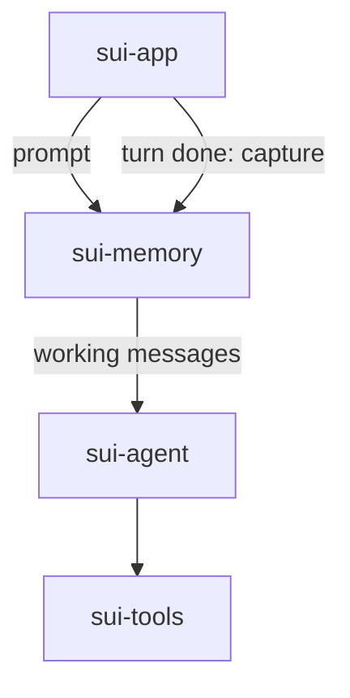

# Zettelkasten 着想のメモリエンジン

調査対象: セッション横断の LLM コンテキスト管理。構想は fleeting note の永続化と promote（再合成）による次回プロンプト組み立て。ストアは SQLite。ドライバは rusqlite（同期）。抽出は FTS5。リンクがあるときだけ recursive CTE。
現状: `sui-app` の `chat_history` はターンごとに置換され、上限も圧縮もない。検索は `sui-tools` のコード向け BM25 / Tantivy。永続ジャーナルは `sui-workflow` の再生ログ。sqlx は設計から外す。

## 結論

設計は **実現可能** だが、そのまま全部を最初から作る必要はない。解くべき問題は一つだけである。

**次の sample に載せるトークン列を、有限予算で組み立てる。**

「重要なものを残し、それ以外を忘れる」はホストが解けない問題である。何が重要かは次のユーザー発話が決める。転換は正しい。忘却は削除ではなく、**今回の予算に選ばれなかった**ことである。

SQLite + FTS5 はその抽出に足りる。ドライバは rusqlite の同期 API で足りる。async で包まない。recursive CTE はリンクを持つときだけ 1–2 hop の近傍拡大に使う。Tantivy をノート用に二重に持たない。埋め込みも持たない。

`code_search` の Okapi/Lucene 系 BM25 と FTS5 の `bm25()` は **同名の別物** である。符号、IDF、トークン、コーパス、クエリ単位が違う。スコアを共有・加算・共通トレイト化しない。抽出の融合が要るなら順位だけを RRF する。

コード検索を同じ SQLite ファイルに載せることは **検討の余地がある**。ただしコンテキスト組み立てのためにコード本文をノートと JOIN してプロンプトへ先入れするためではない。相乗りの単位はエンジン（rusqlite + 別テーブル + 明示の indexing フェーズ）であり、ランキングでも FTS 表でもない。ノート抽出が閉じてから、起動時 `index_tree` と Tantivy を畳む理由が残っているときだけやる。

最初に実装すべきは「カードの袋 + FTS 抽出 + 予算カット」である。Zettelkasten の語彙、進化するノート、LLM による promote 再合成は、抽出がプロンプトを実際に短くしてから足す。



## 第一原理

モデルはトークンしか見ない。ディスクもセッションも持たない。ホストはディスクを持つが、次の発話で何が必要かは知らない。

分解すると三つの操作になる。混同してはいけない。

| 操作 | 質問 | 今の sui |
| --- | --- | --- |
| 捕獲 | このターンから何をディスクに残すか | 何も残さない。`chat_history` が RAM で伸びる |
| 抽出 | 次の予算にどのカードを載せるか | 全部載せる |
| 組み立て | 選んだカードをどのメッセージ列にするか | `Vec<ChatMessage>` をそのまま送る |

他エージェントの「記憶 / 忘却」は、この三つを一つの要約パスに畳んでいる。要約は不可逆なので、次のターンで必要だった細部を復元できない。カードにして抽出にすると、捨てたのはプロンプトからであってディスクからではない。

Luhmann / Ahrens の Zettelkasten で fleeting note は **捨ててよい受信箱** である。永久ノートがリンクされた知識である。構想の「fleeting を永続化し promote する」は語彙が逆立ちしている。残す実体はカード（atomic claim）であり、fleeting は未処理の受信箱だけに使う。promote は「永久ノート化」ではなく **今回の working set に入れる** ことである。語を混ぜると、書き込み時の LLM 再書きと読み取り時の抽出が一つの動詞になる。

A-Mem（Xu et al., NeurIPS 2025）は同じ着想を、書き込み時に LLM で注釈・リンク・既存ノート更新まで行う。それは別の問題（蓄積時にグラフを育てる）を解いている。コーディングエージェントの主問題は蓄積の豊かさではなく、**ツール結果で膨らんだ履歴を次の sample から外す**ことである。書き込み時 LLM は後回し。



## 現状（sui がすでに持っているもの）

コンテキストは三箇所に分かれている。メモリエンジンは四つ目を足すので、既存の三つを乗っ取らない。



- `App::chat_history` は最初のエージェントターンで `system_prompt(cwd)` を先頭に置き、`Done` で完全置換する。失敗時はユーザー行を楽観的に積まない。上限はない。ツール結果は履歴に残る。
- `code_search` はワークスペースのソースに対する語彙検索である。ノートではない。トークナイザは ASCII / camelCase / snake_case。スコアは自前の Lucene 系 IDF で、大きいほど良い。Tantivy は同じトークン列の永続インデックスであり、ノート用 FTS5 とは別エンジンである。
- `Journal` はワークフローの content-hash 再生である。意味検索の対象ではない。ノートストアと混ぜると、チェックサム不変条件が壊れる。

メモリはツールループの外側にある。`run_turn` が `messages` を全部送る前提を、ホストが「短い working set を渡す」に変える。ツール契約（name + schema + execute）は触らない。

## 他エージェントが解いている別の問題

| 手法 | 解いている問題 | カード抽出との関係 |
| --- | --- | --- |
| 履歴を全部送る（今の sui、初期の多くの CLI） | 実装が最短 | 予算を食い潰す。忘れる手段がない |
| compaction / 要約（Claude Code、Pi、多くのハーネス） | 窓が溢れる前に履歴を短くする | 不可逆。細部が要るターンで失敗する |
| 常時注入 MEMORY.md / CLAUDE.md | ユーザーが書いた規範を毎回見せる | カードではない。短い standing orders には残してよい |
| MemGPT / Letta の階層メモリ | モデルにページイン・アウトさせる | ツールが増える。抽出をモデルに委任する |
| ベクトル RAG | 言い換えに強い類似検索 | ローカルコーディングの識別子・エラー文には語彙の方が強い。sui はすでに BM25 を選んでいる |
| A-Mem の進化グラフ | 書き込み時にノート網を更新する | 毎ターン LLM。コーディングのツールダンプ圧縮には過剰 |

「重要な情報を残しそれ以外を忘れる」は compaction の問いである。構想の転換（どれを promote するか）は抽出の問いである。両方必要になったら、抽出のあとに古い working set だけ要約すればよい。要約を正本にしない。

## データモデル（最小）

カードは一文の主張である。会話ログのスライスではない。ログを残すなら別テーブルにし、検索対象にしない。

```text
note
  id            INTEGER PK
  body          TEXT NOT NULL     -- 人間が読める原子的主張
  kind          TEXT NOT NULL     -- claim / decision / constraint / open
  session_id    TEXT
  created_ms    INTEGER NOT NULL
  source_hash   TEXT              -- 任意。どのターン由来か

link
  src           INTEGER NOT NULL
  dst           INTEGER NOT NULL
  rel           TEXT NOT NULL     -- cites / contradicts / follows
  PRIMARY KEY (src, dst, rel)

note_fts        FTS5(body, kind)  -- content=note または外部 content
```

これ以上の列（タグ配列、埋め込み、folgezettel 番号、inbox フラグの山）は、抽出クエリがそれを読まない限り削除対象である。

リンクは **抽出が近傍を使うときだけ** 書く。書き込み時に LLM で「関連ノートを探せ」は A-Mem であり、最初は FTS で既存カードを引き、ヒットした id に `cites` を張る程度で足りる。リンクが空なら CTE は動かない。それでよい。

## 抽出：FTS5 シード + 任意の CTE + 融合スコア

SQLite FTS5 は仮想テーブルに転置インデックスを持ち、補助関数 `bm25()` と隠れ列 `rank` を返す。ノート抽出は **この順位だけ** を使う。`sui-tools::Bm25Index` のスコア関数は呼ばない。

`ORDER BY rank` は `ORDER BY bm25(table)` より速い（SQLite ドキュメント）。列ウェイトが要るときだけ `bm25(note_fts, w_body, w_kind)` を使う。

シードはユーザー発話（と直近のカード本文）を FTS クエリにした MATCH である。FTS5 クエリ言語は AND/OR/NOT/フレーズ/プレフィックスを持つ。モデルが出した自然文をそのまま MATCH に渡すと構文エラーになる。クエリはホストが FTS 向けにエスケープ / トークン化する。コード検索の `tokenize` は使わない。

recursive CTE はグラフを全走査するためではない。FTS で得た id 集合を起点に、深さ 1–2、行数 LIMIT 付きで隣接を足す。

SQLite の制約（公式 `WITH` ドキュメント）:

- サイクルは `UNION`（重複行を捨てる）で止める。`UNION ALL` は無限ループしうる。
- 重複排除のため `UNION` は生成行を保持する。ホップと LIMIT を先に付ける。
- recursive-select の `ORDER BY` は探索順（BFS/DFS、新しい方優先）を変えられる。
- recursive-select の `LIMIT` は再帰テーブルに入る行数の上限になる。
- デフォルトの再帰深度は大きく取れるが、コーディングノートでは深さ 2 で打ち切る。深いほどノイズが増える。

スコアは一つの関数にしない。スケールが違う。

| 信号 | 向き | 由来 |
| --- | --- | --- |
| FTS `rank` の順位 | より負が良い（値そのものは足さない） | 語彙一致 |
| リンク距離の順位 | 浅いほど良い | CTE |
| 新しさの順位 | 新しいほど良い | `created_ms` |
| session 一致 | バイナリ | 同じセッション |

融合は Reciprocal Rank Fusion（各ランキングの `1/(k+rank)` を足す）。FTS の生 `bm25()` と `Bm25Index` の生スコアは加算しない。スケールも符号も IDF も違う。

予算カットはトークン概算（文字数 / 4 で足りる。正確な tokenizer は後）で上から詰める。system prompt と **今のユーザー発話** は常に残す。カードは user メッセージの前に、短いブロックとして足す。assistant/tool の生ログは載せない。それが忘却である。



## 二つの BM25 は別エンジンである

名前が同じなので混ぜたくなる。混ぜない。`code_search` が解いているのは「この識別子はどのファイルか」である。FTS5 が解いているのは「この発話に近いカードはどれか」である。コーパスもトークンもクエリ単位も IDF も符号も違う。

| | `sui-tools::Bm25Index`（と Tantivy 経路） | SQLite FTS5 `bm25()` |
| --- | --- | --- |
| コーパス | ソースファイル。拡張子・サイズ・symlink ポリシー付き | 原子的カード本文 |
| トークン | ASCII 英数 / `_`、camelCase / snake_case 分割 | FTS5 トークナイザ（既定は unicode61 系）。コード分割はしない |
| クエリ | ユニークトークンのバッグ。フレーズなし | MATCH のフレーズ列。AND/OR/プレフィックスがある |
| TF 飽和 | Okapi: `tf*(k1+1) / (tf + k1*(1-b+b*dl/avgdl))` | 同じ形。`k1=1.2`, `b=0.75` はハードコード |
| IDF | Lucene 系 `ln(1 + (N-df+0.5)/(df+0.5))`。常に正 | Robertson `ln((N-n(qi)+0.5)/(n(qi)+0.5))`。df が N/2 を超えると負になりうる |
| 符号 | 大きいほど良い。`ORDER BY score DESC` | 公式が `-1` を掛ける。より負が良い。`ORDER BY rank` 昇順 |
| 単位 | ターム（トークン） | フレーズ |
| 列ウェイト | なし | `bm25(table, w0, w1, …)` |

共通しているのは「語彙頻度と文書長で並べる」という族だけである。実装を共有する理由はない。`LexicalSearch` トレイトで FTS5 を包まない。ノート抽出のテストは FTS の順位で書く。コード検索のテストは `Bm25Index` の順位で書く。

融合が必要なら **順位** だけを RRF する。`rank` の -3.2 と `SearchHit.score` の 12.4 を足すと、符号と IDF の差が順位を壊す。

## `code_search` の SQLite 相乗り

「コンテキスト組み立ての都合でコード検索も SQLite に載せ、indexing フェーズを新設してリライトする」は、問いが二つ混ざっている。分けてから残す。

組み立てが今必要としているのは、カードの working set である。`code_search` はターン中のツールである。ヒットは `role: tool` で履歴に入る。ホストが sample 前にソース本文を JOIN して載せる必要はない。カードにパスがあれば、モデルがツールで読む。コードの正本をプロンプトに先入れするのは、ツールループを RAG に戻すことである。その都合だけではリライトしない。

相乗りを検討してよい本当の理由は、組み立ての JOIN ではなく **索引の置き場** である。

今の `code_search` はすでに indexing フェーズを持っている。名前が無いだけである。起動時に `Bm25Index::index_tree` がディスクを歩き、RAM に最大 10 000 件積む。Tantivy は同じ walk の永続版だが、`index_tree` がディレクトリを消して作り直す。起動のたびに全走査するか、破壊的な再ビルドか、のどちらかである。rusqlite をノートのために払ったあと、同じコストをもう一つの転置インデックスに払う理由は薄い。



残してよい相乗り:

| 載せる | 載せない |
| --- | --- |
| 同じ DB ファイルの **別テーブル** `file` / `file_fts` | ノートとソースを一つの FTS 表にする |
| indexing フェーズが `file_*` だけを差分更新する | 再インデックスでノートを DROP する |
| 投入前に既存 `tokenize` で識別子分割（Tantivy と同じ前処理） | FTS5 既定トークナイザにコードを直入れして camelCase を捨てる |
| カードのパスから `file.path` を解決する CTE（id だけ） | 解決したファイル本文を working set に自動注入する |
| `code_search` は `file_fts MATCH` の順位を返す | `note_fts.rank` と `file_fts.rank` を足す |

indexing フェーズ（コード側）の最小契約:

```text
file
  path          TEXT PRIMARY KEY
  content_hash  TEXT NOT NULL
  snippet       TEXT
  indexed_ms    INTEGER NOT NULL

file_fts        FTS5(path, tokens)   -- tokens = tokenize(source) を空白結合
```

1. `visit_code_files` は今のコーパスポリシーのまま（拡張子、1 MiB、secret、symlink なし、`target` スキップ）。
2. パスごとに content hash を見て、変わった行だけ UPSERT する。消えたパスは `file` から消す。`note*` は触らない。
3. クエリはホストが `tokenize` してから MATCH する。コード検索の識別子分割は残る。順位は FTS5 側に移るので、Lucene 系 IDF の数値は捨てる。ヒットの **パス集合** が回帰の対象である。スコアの絶対値は対象にしない。
4. 起動は「DB を開く」。初回または hash 不一致のときだけ walk する。これが indexing フェーズを名前付きにする意味である。

時期。ノートの袋が working set を短くする前にコード検索を載せ替えると、メモリ設計が「索引が古い」「FTS の順位が変わった」に巻き込まれる。先にカード抽出を閉じる。そのあと、起動時 walk が soreness として残る、または Tantivy と RAM 索引が両方生きている、なら SQLite に畳む。Tantivy は永続語彙索引として重複になるので、そのとき削除対象である。`Bm25Index` はユニットテストと DB 無しの煙テストに残してよい。

ワーカーと TUI。`code_search` は LLM ワーカー上で同期に走る。ノート接続は TUI が所有する案と衝突する。相乗りするなら、**ファイルを共有し接続はスレッドごとに開く**（WAL）。TUI のノート接続とワーカーの検索接続は別ハンドルである。一つの `Connection` を `ToolRegistry` に `Arc` しない。

## 技術選定

### SQLite

ノートは小さく、トランザクションが要り、グラフと全文が同じファイルに載る。プロセス内、依存ゼロに近い、クラッシュ耐性は `journal_mode=WAL` + コミット時 `synchronous=NORMAL` でコーディング TUI には足りる。ワークフローの `fsync` 出力ゲートほど強くしなくてよい。ノートは再生同一性ではない。

### rusqlite（同期 API）

同期であることは障害ではない。sui の I/O 境界にすでに合っている。

今のスレッド模型:



- TUI スレッドは LLM を待たない。`agent_spawn` はすぐ戻り、チャンネルを poll する。
- LLM / ツールループは **別 OS スレッド** の current-thread runtime で `block_on` する。
- `code_search` も `edit` も、そのワーカー上で **同期** に走る。`Tool::call` の戻りが `Future` なのは bash の sleep / wait のためである。BM25 検索は `async move { self.index.search(...) }` で、中身は同期 CPU である。

メモリの MVP はツールループの外にある。

1. **抽出:** `agent_spawn` の直前、TUI スレッド。ユーザー発話から FTS して working set を組む。ノート数が 10^5 未満ならミリ秒。crossterm の 80ms スピナー間隔より短い。
2. **捕獲:** `Done` の直後、同じ TUI スレッド。ホスト規則で INSERT。
3. sample 中は DB に触らない。

この二点だけなら `Connection` は `App` が所有して TUI スレッドだけで使う。rusqlite の契約と一致する。`Connection` は `Send + !Sync`。一つの接続を同時に二スレッドから叩かない。SQLite の multi-thread モード（rusqlite 既定の `SQLITE_OPEN_NOMUTEX`）は「接続ごとに一個のスレッド」を要求する。ちょうどそれである。

後から `note_write` をツールにするなら、ワーカーに **別の** `Connection` を開く。WAL なら読みと書きはファイルレベルで共存する。一つの `Connection` を `Arc` で共有しない。`r2d2` も `tokio-rusqlite` も `spawn_blocking` も要らない。接続プールはスレッドが増えてから足す。今はスレッドが二つで、メモリ I/O は片方にしかない。

TUI スレッドで同期 SQL を呼ぶことの拒否理由は「イベントループを止める」である。止める長さがディスク上の短い FTS なら、すでに `bang` の同期シェルより短い。LLM の 10 分タイムアウトやツールの 30s bash とは桁が違う。async 化は、この計測が悪くなってからにする。

ワークスペースは `unsafe_code = deny` だが、依存の rusqlite / libsqlite3-sys は対象外である。自 crate に unsafe を書かない。

**推奨:** `rusqlite` + `features = ["bundled"]`。実行時 SQL。コンパイル時クエリ検査なし。Postgres なし。sqlx なし。

### FTS5

`bundled` は通常 FTS5 込みである。システム libsqlite に動的リンクすると、ディストロが FTS5 なしでビルドしていることがある。sui は flake / crane でビルドするのでバンドルを選ぶ。C コンパイラが要る。

今の `flake.nix` の `devShells.default` は `mkShellNoCC` で、crane の `commonArgs` に `nativeBuildInputs` がない。rusqlite bundled を足すと、**flake に `clang` を足す**のが前提条件になる。メモリ設計ではなくビルド設計のコストである。無視できない。

日本語本文は FTS5 `unicode61` の方が、コード検索の ASCII トークナイザよりましである。コード識別子をカードに書くなら、投入前に既存 `tokenize` で前処理するか、書かない。コード検索のトークナイザを FTS5 に移植して「BM25 を揃える」のは、上の表が示す通り揃わない。やらない。

### recursive CTE

rusqlite からはただの SQL である。ドライバ制約はない。制約はクエリ設計側（サイクル、LIMIT、深さ）にある。

リンク表が空、または抽出がシードだけで予算を埋めるなら、CTE を走らせない。グラフは最適化ではない。リンクが無い抽出を遅くするだけである。

## 捕獲：誰が「重要」を決めるか

抽出より捕獲の方が難しい。SQLite は助けない。

候補をdumb順に並べ、上から試す。

1. **ホスト規則。** ユーザー発話、ファイルパス、`edit` 成功、明示の決定文。ツールの生 stdout はカードにしない。実装が短い。再現できる。
2. **モデルがツールで書く。** `note_write(body, kind)` をレジストリに足す。モデルは残さない。プロンプトに「残せ」と書くと、残すこと自体がタスクになる。
3. **ターン後の LLM 抽出。** 別 sample で主張を抜き出す。品質は上がりうる。毎ターンのコストと失敗（幻覚カード）が乗る。

最初は 1 だけにする。2 はループが閉じたあとの任意ツール。3 は評価セット（「この失敗は前のセッションの制約を忘れた」）が取れてから。

カード本文の規則: ファイルパスと制約は具体的に。会話の要約は書かない。要約は compaction に戻る。

## promote（再合成）をどこまでやるか

構想の promote は「選んだ fleeting から次回プロンプトを再合成する」である。合成には二段階ある。

| 段階 | 中身 | 最初に要るか |
| --- | --- | --- |
| 選択 | スコア順に予算へ入れる | 要る。これが忘却の定義 |
| 整形 | カードを `## notes` ブロックで連結する | 要る。コード数行 |
| 再書き | LLM にカードを一つの briefing に書き換えさせる | 不要。情報を減らし、遅延と幻覚を足す |

再書きが必要になるのは、カード同士が矛盾し、モデルが両方を同時に信じたときである。そのときは矛盾リンク `contradicts` を抽出し、新しいカードを足す。古いカードを消さない。削除は履歴を消すのと同じ失敗である。

working set のメッセージ形は、system を汚さない。カードは user の直前の一つの user メッセージ、または先頭付近の専用 user/assistant 対にする。system にカードを混ぜると、standing orders と事実が毎回入れ替わる。既存の短い `system_prompt` は残す。

## ワークスペースへの置き方

新しい crate（仮に `sui-memory`）がストアと抽出を持つ。`sui-agent` は `messages` の組み立てをホストに残す。`sui-app` がターン前後に呼ぶ。



`sui-tools` の Tantivy にノートを載せない。コーパスポリシー（拡張子、サイズ上限、symlink）がノートと違う。インデックス破壊（`index_tree` はディレクトリを消して作り直す）もノート永続と両立しない。逆方向（コードを SQLite に載せる）は上の「相乗り」節。同じファイルならよく、同じ FTS 表ならよくない。

DB パスはワークスペースローカル（例 `.sui/memory.sqlite`）かユーザーキャッシュ。gitignore する。ワークフロー checkpoint とファイルを共有しない。

## Musk の 5 ステップで削った結果

| 残した | 捨てた / 後回し |
| --- | --- |
| 原子的カード + FTS5 抽出 + トークン予算 | 履歴全体の LLM 要約を正本にすること |
| ノートは `note_fts`、コードは今は `Bm25Index`。のちに別テーブルなら可 | 同一 FTS 表、生スコア加算、ソース本文の自動注入、ノートを消す再インデックス |
| リンクは任意。CTE は深さ 2 と LIMIT | 書き込みのたびに既存ノートを LLM で進化させる A-Mem |
| 選択 + 連結を promote と呼ぶ | 抽出後の LLM 再合成 |
| rusqlite 同期、bundled SQLite、TUI スレッドがノート接続を所有 | sqlx、`tokio-rusqlite`、`spawn_blocking`、接続プール、Postgres |
| 捕獲はホスト規則から | 重要度スコアの学習、タグ分類器 |
| メモリ crate を履歴・コード検索・journal から分離 | モデルにページインさせる MemGPT ツール一式 |

「just in case」で残さないもの: folgezettel 番号、inbox ワークフロー UI、複数トークナイザ、ノートの git 同期、暗号化、マルチプロセスリーダー向けの複雑な WAL 運用。

## リスク

| リスク | 中身 | 緩和 |
| --- | --- | --- |
| 捕獲がゴミを書く | FTS がゴミを返す | ホスト規則。ツールダンプをカードにしない。上限件数 |
| MATCH 構文エラー | 自然文を FTS クエリに直入れ | ホスト側トークン化。失敗時は recency フォールバック |
| 二つの BM25 を足す | 符号・IDF・トークンが違う | エンジンを分けたまま。融合するなら順位の RRF だけ |
| 再インデックスがノートを消す | 同じ DB をコード walk が DROP する | `file_*` だけ更新。ノート表は indexing の対象外 |
| ソースを working set に JOIN する | ツールを RAG に戻す | カードはパスまで。本文は `code_search` / 将来の `read` |
| CTE 爆発 | 密なリンク + UNION ALL | 深さ 2、LIMIT、UNION、リンクを稀にする |
| 二重の真実 | カードとディスク上のコードがずれる | カードにパスを書き、詳細は `code_search` / 将来の `read` に任せる。メモリは規範と決定、コードはツール |
| flake | bundled SQLite が C を要求 | `mkShellNoCC` をやめるか、メモリ crate だけ `clang` を足す |
| 接続をスレッド間で共有 | `Connection` は `!Sync` | TUI が一個所有。ツール化したらワーカーは別接続。`Arc<Connection>` は作らない |
| 遅延 | 毎ターンの抽出 SQL | ノート数が 10^5 未満なら FTS はミリ秒。問題にならない |

コードの真実はメモリに置かない。置いた瞬間、リポジトリが正本でなくなる。カードは「なぜそうしたか」「何を試してダメだったか」「ユーザー制約」に限る。

## 検証の仕方（実装するとき）

エンジンを書く前に、失敗の形を固定する。

1. セッション A で制約をカード化する（例: edit はバイト一致、bash は one-shot）。
2. `chat_history` を捨てる。
3. セッション B のプロンプトが制約に触れなくても、抽出が該当カードを working set に入れる。
4. 無関係なカードは予算に入らない。
5. ツールの長い stdout はカードにもプロンプトにも残らない。

回帰は SQL とトークナイザで足りる。LLM をテストに挟まない。捕獲規則と FTS クエリと予算カットは決定的にできる。

ワークスペース検証コマンドは現状どおり:

- `cargo test --workspace`
- `cargo clippy --workspace --all-targets -- --deny warnings`
- `cargo fmt --all`

rusqlite bundled を足す PR では `nix flake check` が C ツールチェイン無しで落ちないことを先に確認する。

## 足す順番

ループは「短い working set で sample できる」までが閉じる条件である。

1. `sui-memory`: SQLite スキーマ、insert、FTS MATCH、予算カット、テスト。CTE なし。
2. flake に bundled SQLite 用の C ツールチェイン。
3. `sui-app`: ターン後にホスト規則で捕獲。ターン前に抽出して `chat_history` の代わりに working set を渡す。直近ユーザー発話は必ず残す。
4. リンク表と深さ 2 CTE。RRF。評価セットでシード単独より良いときだけ残す。良くなければ CTE を削除する。
5. 任意の `note_write` ツール。LLM 再合成は、矛盾カードが実害になってから。
6. 起動時 walk か Tantivy 重複が soreness として残るなら、`file` / `file_fts` と差分 indexing フェーズ。`code_search` をそこに挿す。ノート表は触らない。パス集合の回帰が前の `Bm25Index` と一致することを先に測る。

## 参照

- [SQLite FTS5](https://www.sqlite.org/fts5.html) — `bm25()` の `-1` 倍、Robertson IDF、フレーズ単位、`rank`
- [SQLite WITH](https://www.sqlite.org/lang_with.html) — recursive CTE、UNION とサイクル、LIMIT / ORDER BY
- [rusqlite `Connection`](https://docs.rs/rusqlite/latest/rusqlite/struct.Connection.html) — `Send + !Sync`、既定 `SQLITE_OPEN_NOMUTEX`
- [A-Mem: Agentic Memory for LLM Agents](https://arxiv.org/html/2502.12110v2) — Zettelkasten 着想。書き込み時進化は過剰
- 実装の隣接: `sui/src/main.rs`（起動時 `index_tree`）、`sui-tools/src/corpus.rs`（walk ポリシー）、`sui-tools/src/tantivy_index.rs`（前処理トークン + 破壊的再ビルド）、`sui-tools/src/bm25.rs`（Lucene 系 IDF）、`sui-app/src/llm.rs`（OS スレッド + current-thread tokio）、`sui-workflow/src/journal.rs`（意味メモリではない）
- 先行調査: [`docs/research/agent-tools.md`](agent-tools.md)
